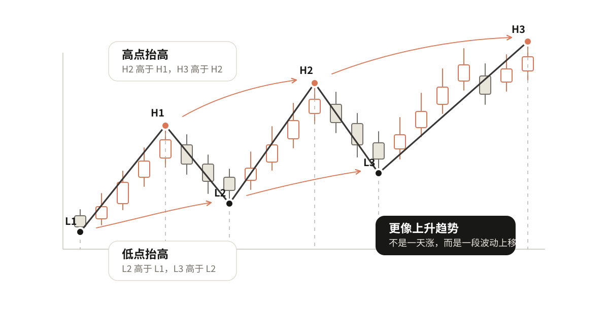
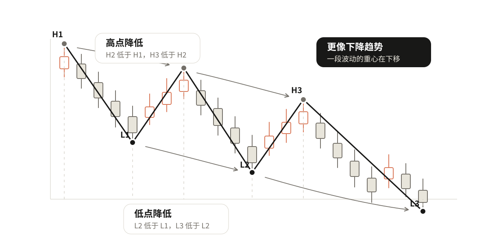
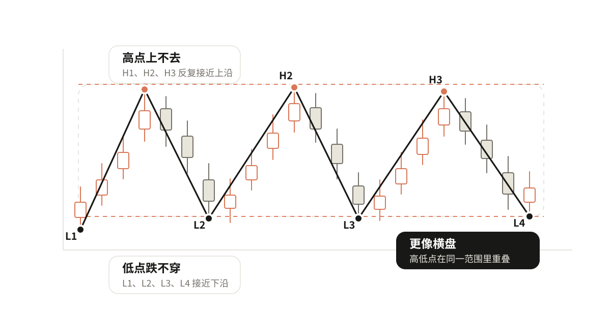

# 01 看清趋势

价格总是涨涨跌跌，今天涨明天跌，连续涨几天又突然回下来。只看眼前一两根K线，很容易被当天的涨跌带着走。

所以看图的第一步，不是马上问"这里能不能买"，而是先看清楚这一段价格，到底更像是在往上走、往下走，还是横着走。

## 先看一段，不看一天

上涨中会回调，下跌中会反弹，横盘中也会突然拉一根阳线或砸一根阴线。所以判断趋势时，看的是一段波动，不是某一天涨跌。

一段波动会留下两类位置：涨上去以后回落留下高点，跌下去以后反弹留下低点。趋势判断最核心的事，就是比较这些高点和低点的变化。

## 上升趋势看什么

后面的高点比前面的高点高，后面的低点也比前面的低点高，这段走势就更像上升。

高点抬高，说明价格有能力往上推。低点抬高，说明每次回调都有人在更高的位置接住。

```text
高点抬高 + 低点抬高 = 上升
```

重点不是"今天涨了"，而是这一段波动的重心在往上移。



## 下降趋势看什么

后面的高点比前面的高点低，后面的低点也比前面的低点低，这段走势就更像下降。

高点降低，说明反弹越来越难突破前面的位置。低点降低，说明下方不断被打穿。

```text
高点降低 + 低点降低 = 下降
```

重点也不是"今天跌了"，而是这一段波动的重心在往下移。



## 横盘看什么

高点上不去，低点也跌不穿，价格主要在一个范围里来回走，就更像横盘。

横盘不是"看不懂就叫横盘"。至少要能看出一个反复争夺的范围：上面有人卖，下面有人接，价格暂时没有走出清楚的上升或下降。

```text
高低点反复重叠 = 横盘
```

如果高点和低点给出的方向互相矛盾，或者波动还太少，就先说"证据不够"，不要急着贴标签。



## 动手看一下：拖动高低点，看趋势分类

<div class="interactive-embed">
  <iframe src="interactives/ch1-trend-drag.html" title="趋势方向演示器" loading="lazy" scrolling="no" style="height:440px"></iframe>
  <p class="interactive-caption">拖动任意高点或低点，观察趋势分类如何实时变化。</p>
</div>

## 练习

看一段已经标好高低点的走势，只做三步：

1. 找出最近两组高点，比较它们是抬高、降低，还是差不多。
2. 找出最近两组低点，比较它们是抬高、降低，还是差不多。
3. 把两边结果合起来，判断上升、下降、横盘，或者证据不够。

真实K线里哪些位置才算高点和低点？下一章讲怎么自己选出来。
