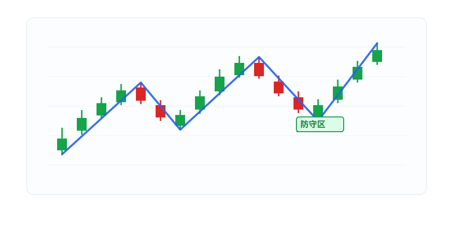
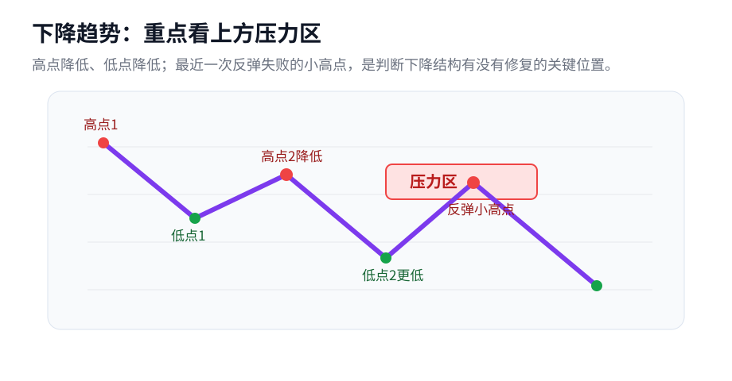

# 01 先看清楚：现在是什么趋势

## 这一章只解决一个问题

打开一张 K 线图，第一件事不是问“能不能买”，而是问：

> 这段走势现在是什么状态？

大致只有四种答案：

- 上升；
- 下降；
- 震荡；
- 证据不够，看不清。

这一章就围绕这个问题讲：为什么要看高点和低点，怎么用高低点判断趋势，判断完趋势以后为什么要找关键线。

## 先说清楚：这里先看日线图

本书前半部分默认用日线 K 线来训练。

也就是说，我们看的不是分时图，也不是 5 分钟图，而是每天一根 K 线。这样训练的是“几天到几周”这一类波段结构，不是当天做 T 的超短线。

后面会讲多级别配合。这里先记住一句话就够了：

> 同一个判断里，不要把日线、周线、分钟线混着用；但不同周期可以分工，大周期看背景，小周期找细节。

本章先只按日线图来讲。

## 为什么判断趋势要看高点和低点

趋势不是一条直线。

上涨也会回调，下跌也会反弹。价格总是一段一段波动着走。所以，要看清楚趋势，就不能只看一根阳线或一根阴线，而要看这一段波动形成的高点和低点。

如果一段走势里，后面的高点比前面的高点高，后面的低点也比前面的低点高，说明价格虽然中间有回调，但整体是在往上走。

如果后面的高点越来越低，后面的低点也越来越低，说明价格虽然中间有反弹，但整体是在往下走。

这就是为什么我们要先找高点和低点。

## 高点和低点怎么选

这里的高点和低点，不是每天都选，也不是只看收盘价。

先用一个最简单的规则：

> 高点：这根 K 线的最高价，比前后几根 K 线的最高价都高。  
> 低点：这根 K 线的最低价，比前后几根 K 线的最低价都低。  
> 一个高点和相邻低点，不能共用同一根 K 线。

简单说：

> 一段上涨之后，价格在某个地方涨不动了，后面出现明显回落，这个地方就可能是一个波段高点。

低点反过来：

> 一段下跌之后，价格在某个地方跌不动了，后面出现明显反弹，这个地方就可能是一个波段低点。

所以，我们选的是“走势发生转向的点”。

一个点值不值得选，主要看三件事：

1. 前面有没有一段明显上涨或下跌；
2. 后面有没有明显反向运动；
3. 这个点会不会影响趋势判断。

如果只是很小的波动，不影响“高点有没有抬高、低点有没有抬高”，就先不要把它当成主要波段点。

这里先用学习版近似规则。严格缠论里会继续用“分型、笔”来更严谨地处理高低点。

## 用高低点判断三种状态

找出主要高低点以后，再看它们之间的关系。

### 上升

```text
高点抬高 + 低点抬高 = 上升趋势
```

高点抬高，说明上方还有突破能力；低点抬高，说明下方还有承接。

### 下降

```text
高点降低 + 低点降低 = 下降趋势
```

高点降低，说明反弹越来越弱；低点降低，说明下方不断被打穿。

### 震荡

如果高点上不去，低点也跌不穿，价格主要在一个范围里来回走，就是震荡。

震荡不是“看不懂就叫震荡”。震荡的意思是：高低点反复重叠，没有形成清楚的上升或下降。

## 判断完趋势，才知道关键线在哪里

判断趋势不是为了贴标签，而是为了知道下一步该盯哪条线。

这里说的“关键线”，不是另一个复杂的新概念。它只是一个总称：

> 对上升趋势来说，关键线主要是防守位；  
> 对下降趋势来说，关键线主要是压力位；  
> 对震荡来说，关键线就是区间上沿和下沿。

也就是说，防守位、压力位、震荡上沿、震荡下沿，都是关键线。它们的共同作用是：帮助我们判断原来的结构有没有被破坏，或者有没有开始修复。

如果是上升趋势，要盯的是下方的防守位。

因为上升趋势的关键是“低点抬高”。一旦最近重要低点被有效跌破，就说明原来的上升结构可能出问题了。所以，防守位是上升趋势里观察转弱、破位、结构切换的重要位置。

如果是下降趋势，要盯的是上方的压力位。

因为下降趋势的关键是“高点降低”。如果价格反弹后连最近的小高点都站不上，说明下降结构还没有被破坏；如果能站上压力位，才开始有转强的可能。

如果是震荡，要盯的是区间上沿和下沿。

因为震荡的关键是价格在一个范围里来回走。没有突破上沿，也没有跌破下沿之前，就先按震荡看。

简单整理一下：

| 当前状态 | 重点看什么 | 作用 |
|---|---|---|
| 上升趋势 | 防守位 / 防守区 | 看上涨结构有没有被破坏 |
| 下降趋势 | 压力位 / 压力区 | 看下降结构有没有被修复 |
| 震荡 | 上沿 / 下沿 | 看区间有没有突破或跌破 |

第一章只讲到这里：先看清趋势，再找到对应关键线。至于价格到了关键线附近以后，到底只是看看，还是已经可以确认，这是第二章要讲的问题。

## 两张最简单的图

第一张图只讲一件事：上升趋势里，后面的低点比前面的低点高；最近这个重要回调低点附近，就是防守区。



第二张图也只讲一件事：下降趋势里，后面的高点比前面的高点低；最近这个反弹失败的小高点附近，就是压力区。



## 防守位为什么常常画成防守区

真实 K 线不是精确到一分钱的数学线。

价格有时会盘中刺破一下，又收回来；也可能在防守点附近反复试探。所以实际看图时，不要把防守位理解成一条绝对精确的线，更适合看成一个小区域。

防守区通常围绕最近那个重要回调低点附近的一组 K 线来画。防守区下沿，常看这组 K 线里最低的刺破位置。

压力位也类似。它不是一条绝对精确的线，而是最近反弹失败的小高点附近的一小块区域。后面能不能收盘站上这个区域，是判断下降结构有没有修复的重要信号。

## 本章小结

这一章的逻辑是：

1. 趋势不是直线，而是波动；
2. 波动会留下高点和低点；
3. 高低点的变化关系，决定我们说它是上升、下降还是震荡；
4. 看清趋势以后，才知道下一步盯哪条关键线；
5. 上升看防守位，下降看压力位，震荡看上下沿。

不要一上来就问“能不能买”。先问：

> 现在是什么趋势？这个趋势的关键线在哪里？
