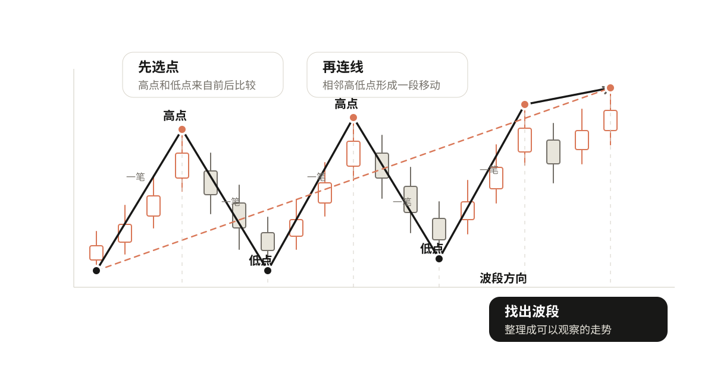
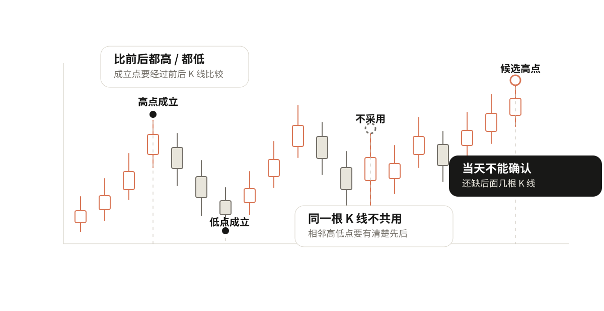
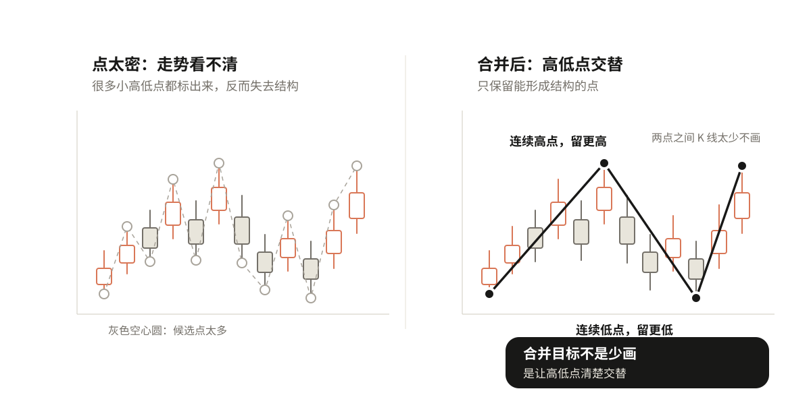
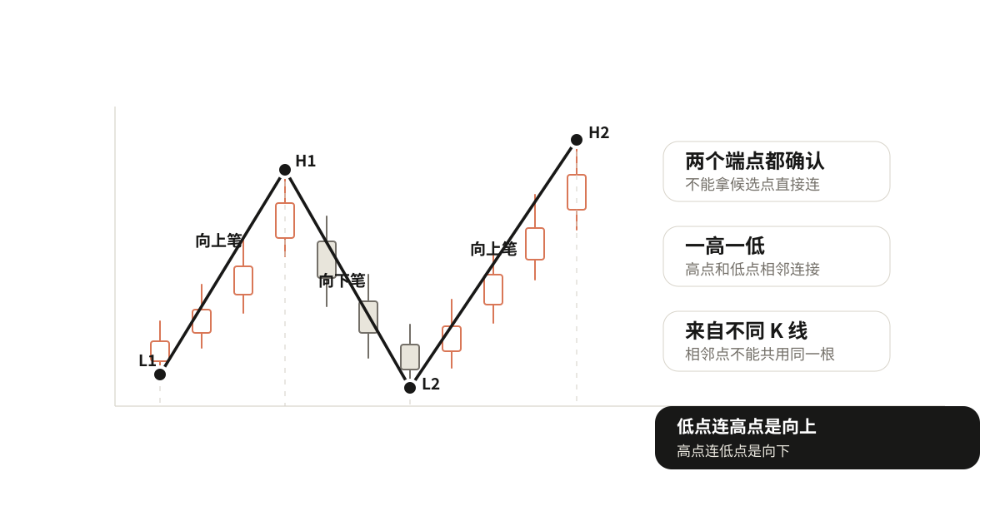
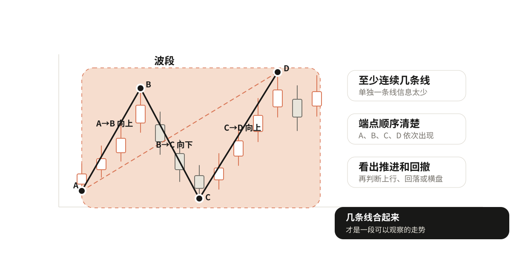

# 02 从K线画出走势

上一章判断趋势时，一直在比较高点和低点。但真实K线图里，高低点不是现成标好的，要自己从K线里选出来，再连成走势。

按一张图的顺序来：

```text
选点 → 连线 → 找出波段 → 看走势
```



## 第一步：先选点

选点就是从K线里选出局部高点和局部低点。后面更严格地讲，这些会对应到"顶分型"和"底分型"。

高点不是某一天涨得多，低点也不是某一天跌得多。它们都要和前后K线比较。

入门阶段先用"前后各两根"的规则：

```text
局部高点：这根K线的最高价，高于前两根，也高于后两根。
局部低点：这根K线的最低价，低于前两根，也低于后两根。
```

选高点看最高价，选低点看最低价。因为我们要找的是价格这一段波动到过的高处和低处。

## 什么样的点不成立

不成立的情况先记几条：

- 只看当天涨跌不成立。一根K线涨得很高，但后面继续涨，它就不是这一小段的高点。
- 当天不能确认。因为高点要比后面几根也高，当天只有前面的信息，没有后面的信息，最多只能说"可能是高点"。
- 相邻高点和低点不能共用同一根K线。低点到高点表示价格从低处走到高处，如果同一根K线同时当相邻高点和低点，顺序就乱了。



## 点太密时怎么合并

真实K线里，小高点小低点很多。全部画出来，线会很碎，反而看不清走势。

点太密时，先合并三类：

- 连续出现两个高点，中间没有低点，保留更高、更清楚的那个。
- 连续出现两个低点，中间没有高点，保留更低、更清楚的那个。
- 两个点之间只有一两根很小的K线，价格几乎没有离开原来的位置，先不要急着画成一笔。

合并的目标不是少画，而是让留下来的点能清楚交替：低点→高点→低点→高点。只有高低点交替，后面的连线才有清楚方向。



## 第二步：把相邻点连成线

点只是位置，连起来才开始变成走势。

一个确认低点连到后面的确认高点，就是一条向上的线，用缠论的话说可以先理解成"一笔向上"。一个确认高点连到后面的确认低点，就是一条向下的线，"一笔向下"。

这条线至少要满足：两个端点都已经确认、一高一低、来自不同K线、连出来以后能说清是一段上涨还是下跌。

更严格的"笔"还有更多条件，后面再展开。现在先把最基础的连线关系画顺。



## 第三步：几条线合成一个波段

一条线只能说明一小段上涨或下跌。几条线连续组合起来，才形成更大的一段走势，这里先叫波段，用缠论的话说后面会对应到"线段"。

比如：底分型A→顶分型B→底分型C→顶分型D，这里有三条线：A到B向上，B到C向下，C到D向上。这几条线放在一起，就形成一个可以观察的波段。

入门阶段先用三个条件判断波段是否清楚：至少由连续几条线组成、每一条线的端点顺序清楚、合起来以后能看出这一段价格是在推进、回撤，还是在一个范围里来回走。

严格缠论里线段还有更完整的成立和破坏条件，这里先不展开。



## 练习

找一段真实K线，按下面顺序做：

1. 用"前后各两根"的规则，标出局部高点和局部低点。
2. 划掉不成立的点：当天不能确认、同一根K线共用、连续同类点里不够清楚的点。
3. 检查剩下的点是否高低交替。
4. 把相邻高低点连成线。
5. 把连续几条线看成一段波段。
6. 再用第一章的方法判断趋势。
