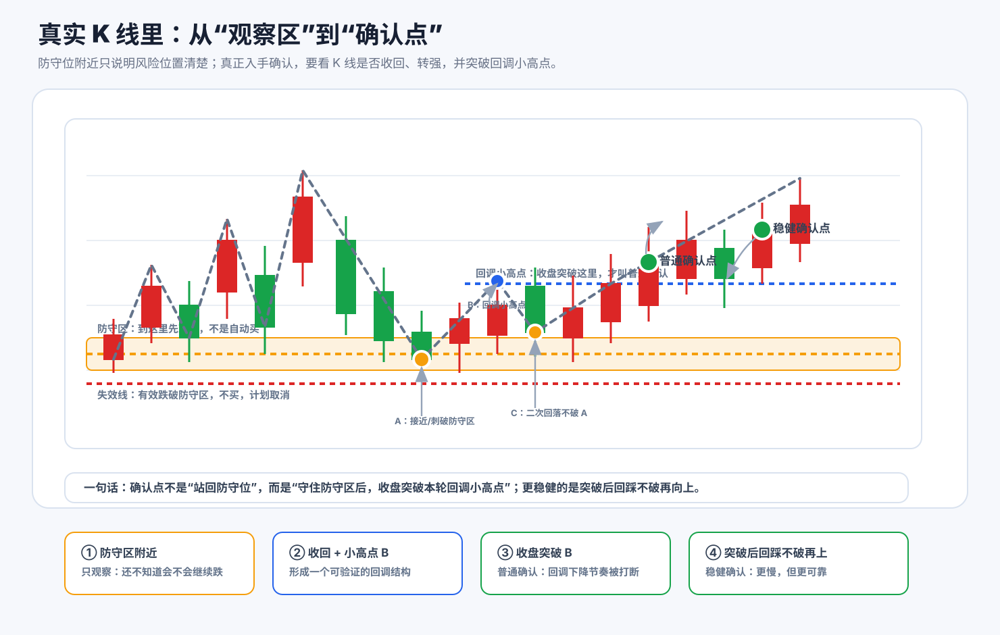
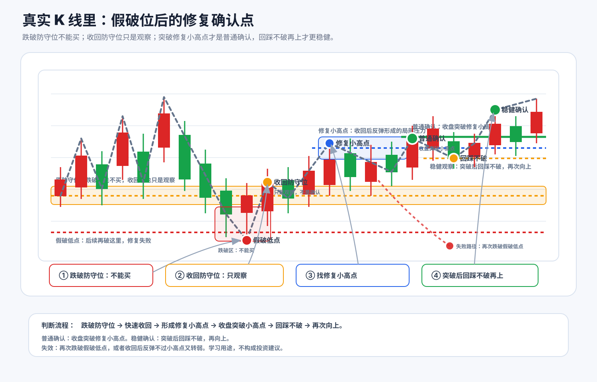
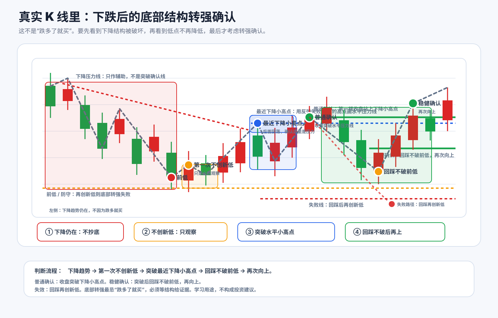
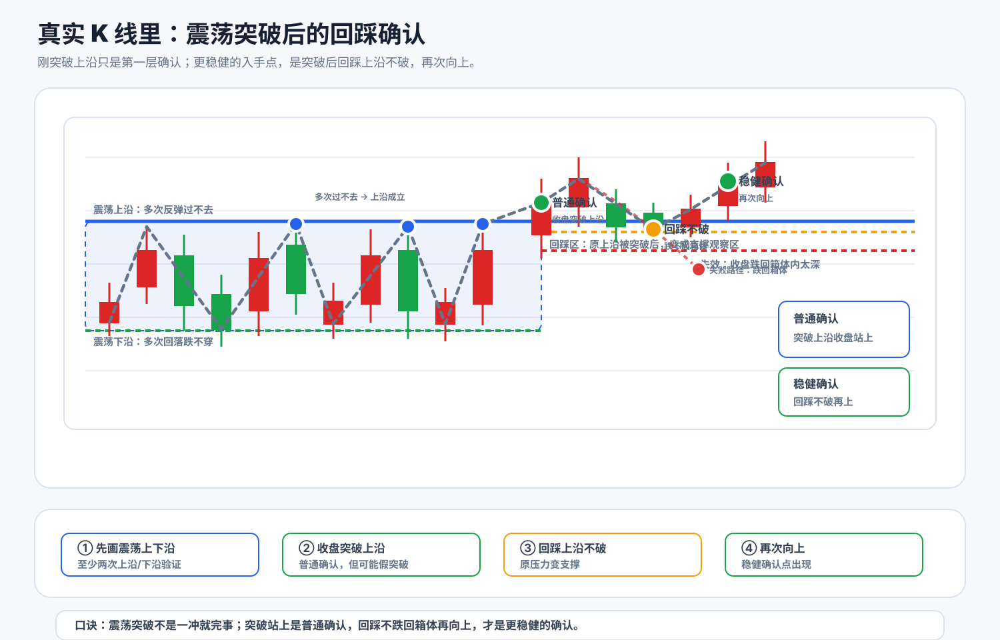
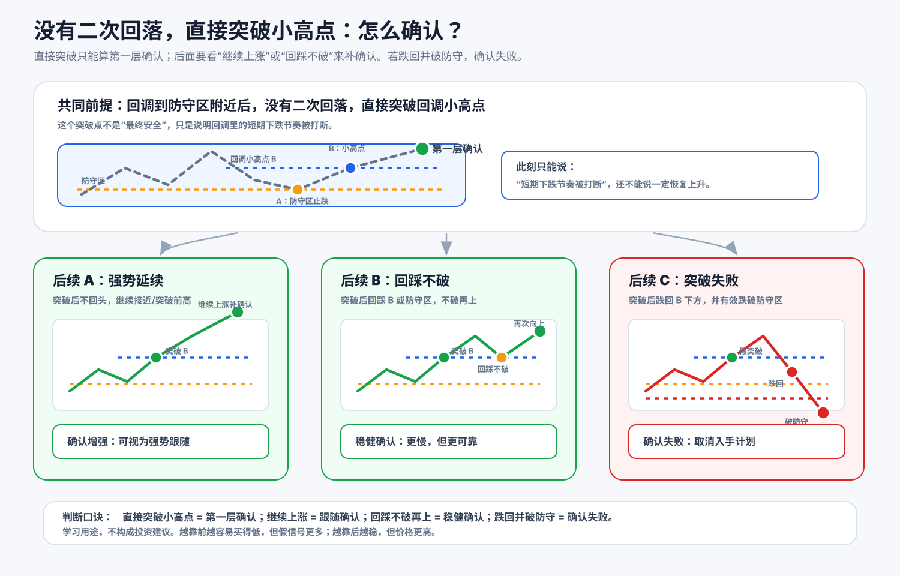
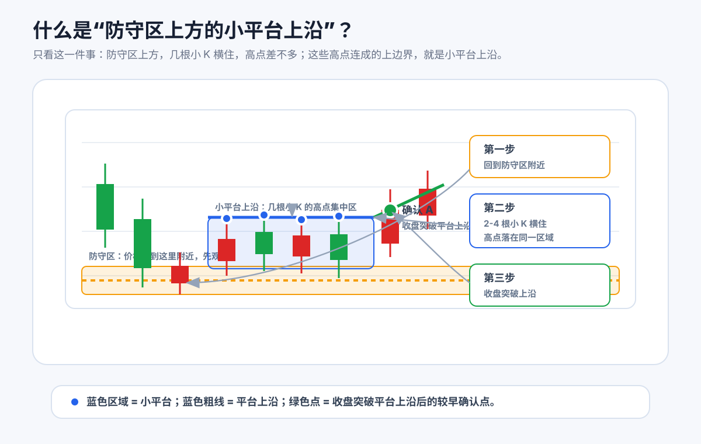

# 02 观察区到确认点

## 本节目标

第一章解决的是：当前是什么趋势，以及这个趋势对应的关键线在哪里。

这一章接着回答下一个问题：

> 价格到了关键线附近以后，接下来怎么判断？

这里的“关键线附近”，就是观察区。

观察区不是随便画出来的，它来自第一章讲的关键线：

- 上升趋势里，价格回到防守位/防守区附近，这是观察区；
- 下降趋势里，价格反弹到压力位/压力区附近，这是观察区；
- 震荡里，价格来到上沿或下沿附近，这是观察区。

观察区的意思不是“可以买”，而是“这里开始值得观察右侧走势”。很多错误就发生在这里：回调到了防守区，就觉得可以买；反弹碰到压力位，就觉得突破了；跌到震荡下沿，就觉得一定会反弹。其实这些都还只是可能。

所以，第二章真正要讲的是：

> 从“价格到了关键线附近”到“结构真的给出确认”，中间要看什么？

我们把这个过程拆成三个层次：

1. 观察区：可以开始观察，但还不能当确认。
2. 第一层确认：出现收复、突破小高点、或站上压力位等证据。
3. 更稳健确认：二次回踩不破、再次转强、失败线可以上移。

## 统一流程

最重要的一句话：

> 观察区只是提醒你“这里值得看”，确认点才说明“右侧结构开始证明你的判断”。

## 四类常见机会

### 1. 上升趋势回调

价格回到防守区附近，不代表可以买。严谨一点的路径是：

1. 回调到防守区附近；
2. 没有有效跌破防守区；
3. 出现反弹；
4. 二次回落不破；
5. 再向上突破回调小高点。

这个“突破回调小高点”的位置，才更接近确认点。

### 2. 下降趋势转强

下降趋势里，不能因为跌多了就买。要看下降结构是否开始被破坏。

常见确认路径是：

1. 找到最近下降小高点或压力位；
2. 收盘站上压力位，形成普通确认；
3. 突破后回踩不破；
4. 再次转强，形成更稳健确认。

注意，这里强调“收盘站上”，盘中冲一下不算。

### 3. 震荡下沿修复

震荡下沿附近也不是天然买点。下沿只是观察区。

比较稳妥的路径是：

1. 到达或刺破震荡下沿；
2. 重新收回区间；
3. 反弹形成修复小高点；
4. 回踩不再跌破下沿；
5. 再次突破修复小高点。

### 4. 震荡上沿突破回踩

突破震荡上沿之后，也不要只看突破当天。

更稳健的路径是：

1. 收盘突破震荡上沿；
2. 回踩到上沿附近；
3. 没有有效跌回原震荡区间；
4. 再次反弹并突破回踩后的短线小高点。

这样才更像“突破后站稳”。

精选图：

## 直接强势突破怎么看

如果没有二次回落，而是直接强势突破，不能只看一根冲高。更严谨的确认至少要看它突破的是哪一个“小高点”或“小平台上沿”，并且最好看收盘是否站上。

这里的“小高点”通常不是随便一个小红点，而是最后一段明显回落前形成的局部高点，或者防守区上方小平台的上沿。

如果突破的是最后明显阴线的高点，这是一层确认；如果突破的是防守区上方小平台的上沿，也是一层确认。关键是你必须能说清楚：突破的到底是哪条线。

## 本章小结

判断能不能买之前，按顺序走：

1. 先判断当前属于哪种结构；
2. 再找对应关键线；
3. 到关键线附近，只叫观察区；
4. 收盘突破对应确认线，才叫普通确认；
5. 突破后回踩守住，再次向上，才叫稳健确认；
6. 如果有效跌破对应失败线，就承认判断失败。
