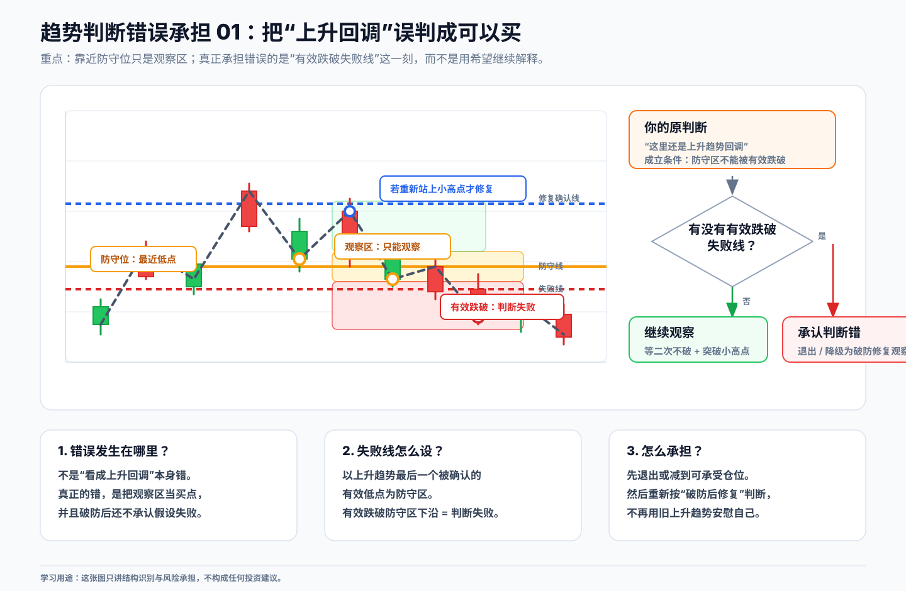
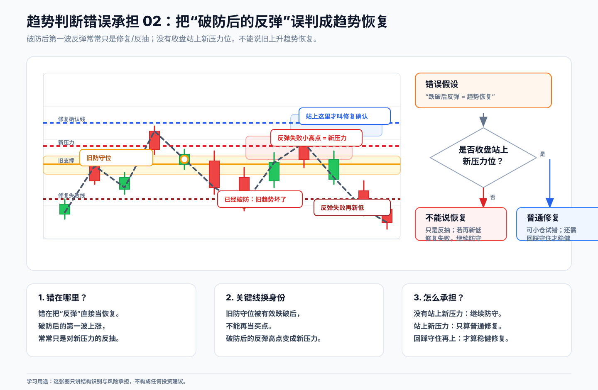
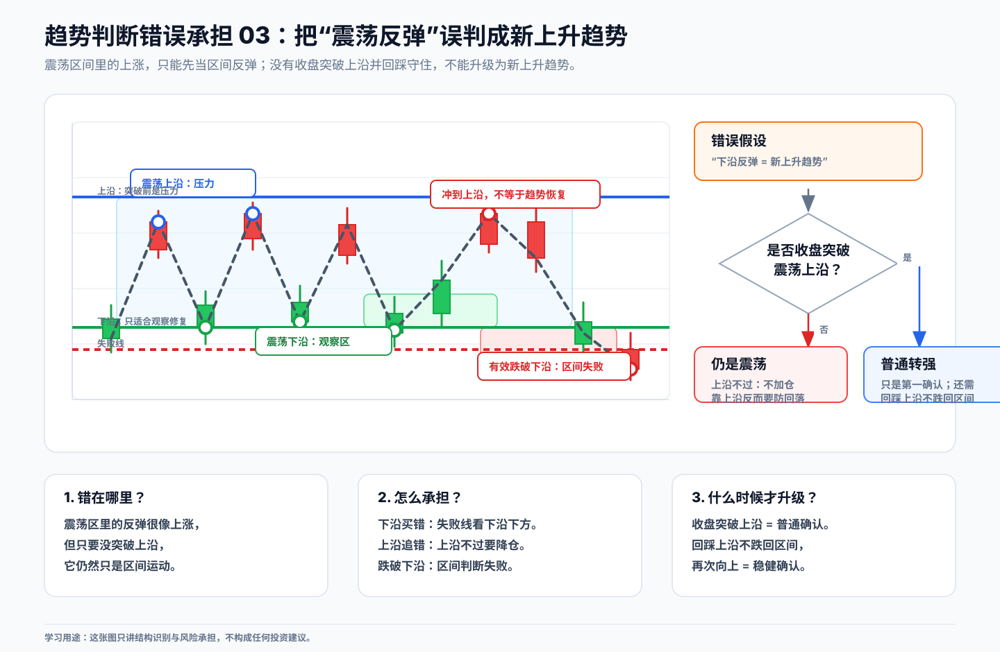
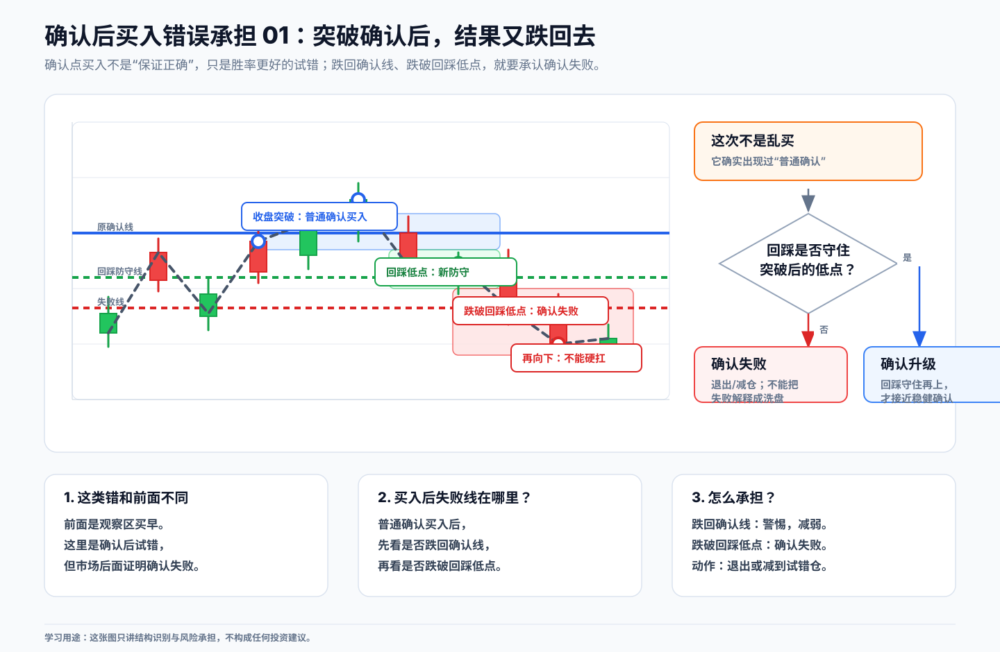
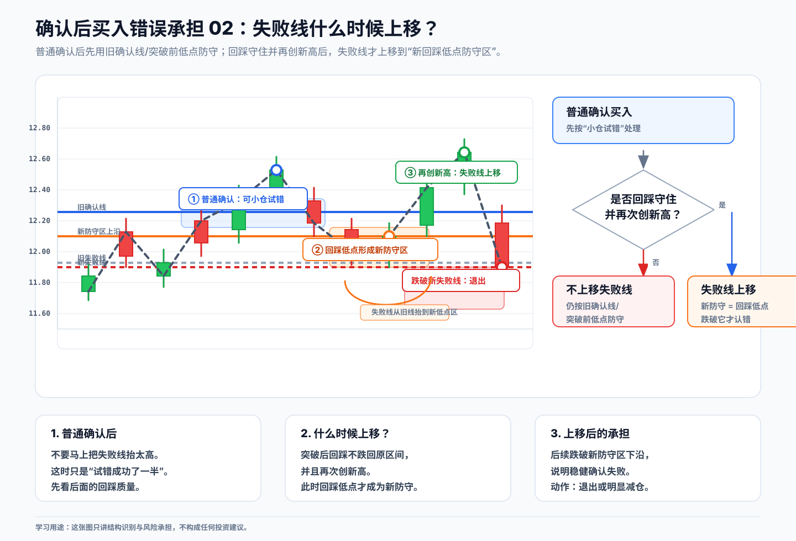

# 03 买入错误如何承担

## 本节目标

真正保护交易的不是“我判断对了”，而是“我知道判断错了怎么办”。

判断错并不可怕。可怕的是买入之前没有想清楚：如果这个判断错了，我在哪里认？

本章把“失败线”讲清楚。

## 失败线是什么

失败线不是一个心理价位，也不是亏了多少就随便出。它应该来自结构。

简单说：

> 失败线 = 当前判断成立所依赖的结构边界。

如果你判断的是“上升趋势回调后继续上涨”，那失败线通常在防守区下沿。因为一旦有效跌破防守区，原来的“低点抬高”结构就被破坏了。

如果你判断的是“破防后修复”，失败线就不一定是旧防守位，而要看破防后形成的新结构，比如修复回踩低点、破防后的低点、或者重新形成的新防守区。

## 错误一：观察区提前买

如果只是到了观察区，还没有确认点就买入，一旦后面创新低或有效跌破失败线，就要承认这是观察失败。

## 错误二：把普通修复当稳健修复

破防之后反弹，如果没有站上压力位，或站上后又二次破防，不能继续假设它已经恢复上涨。

破防之后，常见的新压力位是“破防后的反弹小高点”。后面能不能重新站上这个压力位，是判断走势有没有修复的重要依据。

如果反弹没有站上压力位，或者站上后又二次破防，就不能把它当成稳健修复。

## 错误三：震荡区误判

震荡下沿附近不是天然买点。买入理由必须来自重新收回区间、突破修复小高点、或回踩不破后的再次转强。

## 确认后仍然会错

确认点不是百分百正确。确认后买入，后续如果跌破新的失败线，也要按规则处理。

## 不同结构对应的失败线

不是所有情况都叫“创新低才出”。要看你买入的理由是什么。

| 结构 | 买入理由 | 常见失败线 |
|---|---|---|
| 上升回调 | 防守区守住后转强 | 有效跌破防守区下沿 |
| 下降转强 | 收盘突破下降小高点 | 突破失败后再创新低，或跌回突破位下方 |
| 震荡下沿 | 收回区间并突破修复小高点 | 有效跌破震荡下沿 |
| 震荡上沿突破 | 突破后回踩不回区间 | 跌回原震荡区间，或回踩失败 |
| 破防修复接回 | 突破破防后的新压力位并回踩守住 | 跌破修复回踩低点 |

## 本章小结

买早了没关系，问题是不能硬扛。

如果在观察区提前买，后面没有走出确认，反而跌破对应失败线，就要承认判断失败，退出或降到自己能承受的仓位。

任何买入、接回、加仓动作，都必须同时带着失败线。没有失败线，就不是一个完整动作，只是一个想法。
