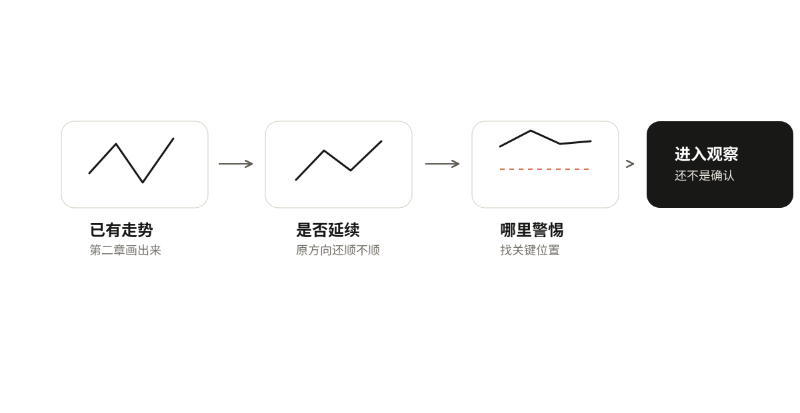
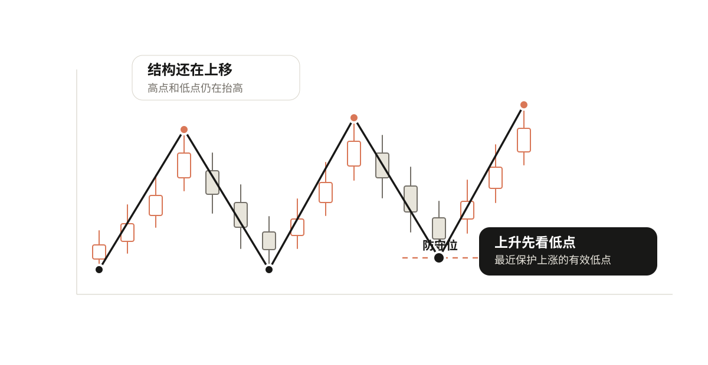
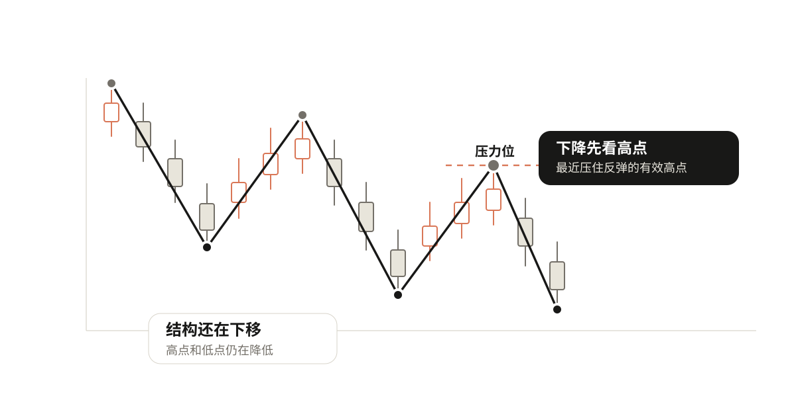
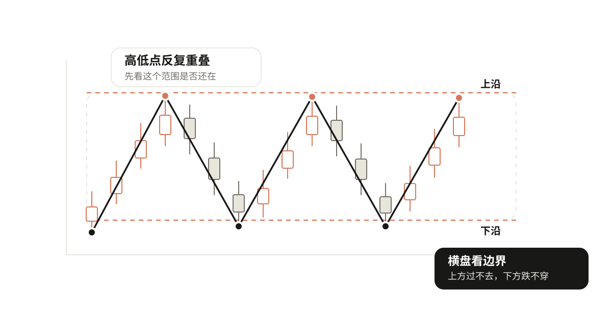
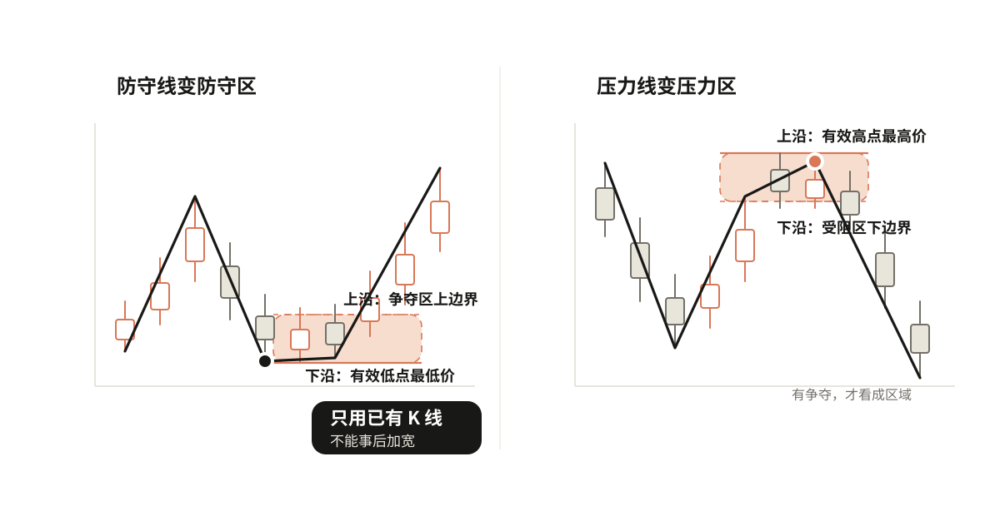

# 04 找到趋势可能改变的位置

第三章已经讲过怎么判断结构推进、震荡和变弱。现在继续往前走：如果走势开始不顺，哪里最值得盯？

## 先确认自己在盯什么结构

不用重新讲一遍趋势。第一章已经讲过怎么看方向，第二章已经讲过怎么画走势，第三章已经讲过怎么判断结构是否还在推进。

这一章只做一件事：把"哪里需要重点盯"找出来。

原来是上升，就找保护这段上升的低点。原来是下降，就找压住这段下降的高点。原来是横盘，就找这个范围的上沿和下沿。

趋势变弱只是提醒你要小心，还不是转折。变弱以后，先找位置；到了位置以后，才进入观察。

## 上升趋势看防守位，下降趋势看压力位

上升趋势里，最值得盯的位置是保护上涨结构的那个低点。因为上升趋势不只是高点在创新高，还要看每次回调之后能不能在更高的位置停住。如果每次回调都留下一个更高的低点，说明上涨的结构还在。

我们把最近那个保护上涨结构的有效低点，叫防守位。价格回到这里附近，就要开始观察上涨结构还能不能守住。

防守位不是随便找一个最近的低点。它要满足两个条件：是第二章规则下选出来的有效低点，而且确实保护了这一段上升——后面的价格从这里附近继续往上走了。如果一个低点太小太近，只是几根K线里的毛刺，不要急着当成防守位。

下降趋势反过来，最值得盯的是压住反弹的那个高点，叫压力位。价格反弹到这里附近，就要开始观察下降结构还能不能压住。压力位同样要满足：是有效高点，而且确实压住了这一段下降。

## 横盘走势看上下沿

横盘里价格没有清楚地一路向上或向下，而是在一个范围里来回走。这时候最值得看的不是某一个单独的高点或低点，而是这个范围的上下边界。

上方反复过不去的位置叫上沿，下方反复跌不穿的位置叫下沿。

上下沿不是随便画两条线。上沿最好来自多次接近之后回落的位置，下沿最好来自多次接近之后反弹的位置。如果只有一次高点和一次低点，还不能急着说这里就是横盘区间。

## 这些位置都叫关键线

上升看防守位，下降看压力位，横盘看上下沿。它们有一个共同点：都是趋势可能发生变化的时候，最需要你重点观察的位置。所以统称为关键线。

关键线不是预测线。不是说价格到了这里就一定会反弹、一定会跌破。它只是提醒你：这里会影响原来的结构，值得重点盯。

## 关键线有时要画成区域

真实的K线很少刚好碰到一条线就转身。有时候会稍微刺破一下，有时候会在附近上下晃几根K线。所以关键线在实际看图的时候，常常要看成一小块区域。

以防守位为例。防守区就是前一个低点附近的一小块价格范围：

- 下沿 = 这个低点的最低价；
- 上沿 = 这个低点附近几根K线的最高价。

为什么上沿这么取？因为价格跌到低点之后，通常不会立刻一根大阳线拉上去，而是会在底部来回晃几根——有的刺破一下低点，有的反弹一点又跌回来。这几根K线晃到的最高位置，就是上沿。

如果低点之后价格直接干净地拉上去了，没有来回晃，那就只画一条防守位线，不画区域。

压力位扩成压力区，逻辑一样。

区域画好了就固定，不能事后随便扩大。不能因为后来价格跌破了原来的防守位，就临时把下沿改得更低。区域必须来自当时已经能看到的K线。

## 你可以自己试试

  <iframe class="h-ch4" src="interactives/ch4-key-line.html" title="关键线演示器" loading="lazy" scrolling="auto" style="height:590px"></iframe>
  
切换三种场景、拖动关键线、切换“线/区”，理解不同趋势下盯什么位置。拖完记住：到了位置，只是进入观察。

## 到了关键位置，只是进入观察

价格回到防守位附近，不代表上涨一定会继续。价格反弹到压力位附近，不代表下降一定会恢复。价格来到横盘的上沿或下沿，也不代表马上会突破或反弹。

这些位置只说明一件事：原来的结构来到了需要检查的地方。到了之后，哪些只是观察，哪些才算确认，下一章讲。

## 自己动手练一下

拿一段已经画好波段的走势，只做四步：

1. 写清当前结构：上升、下降、横盘，还是证据不足。
2. 按结构找关键位置：上升找防守位，下降找压力位，横盘找上下沿。
3. 判断它适合画成一条线，还是需要画成一小块区域。
4. 写一句话说明：如果价格来到这里，我要观察什么。
