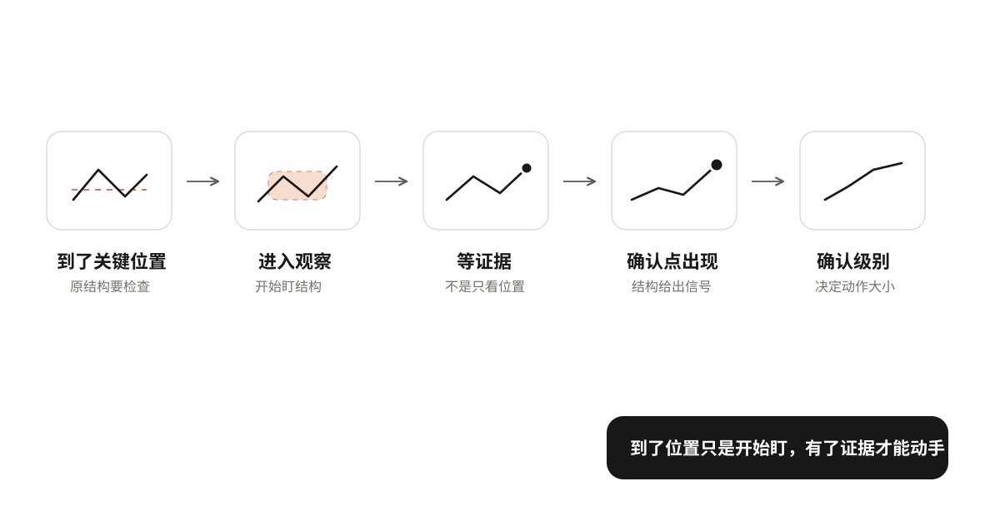
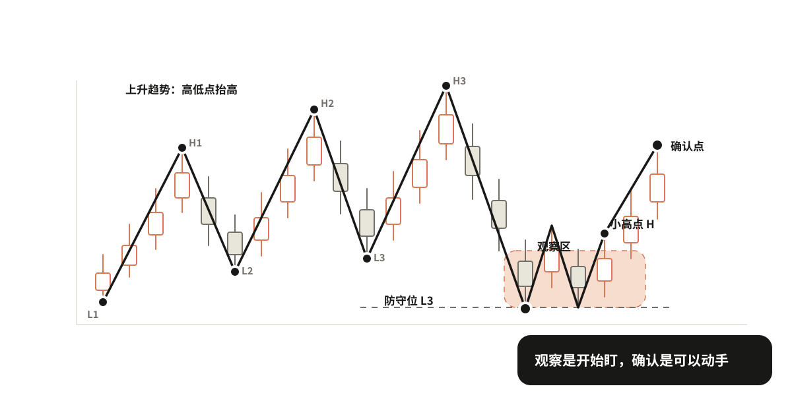
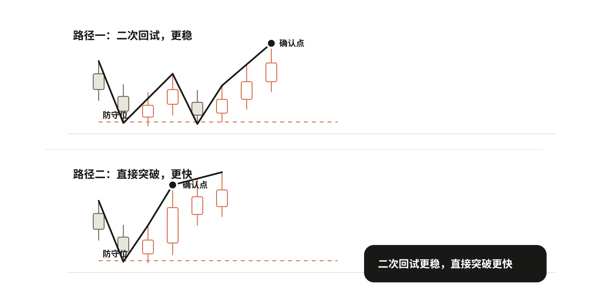
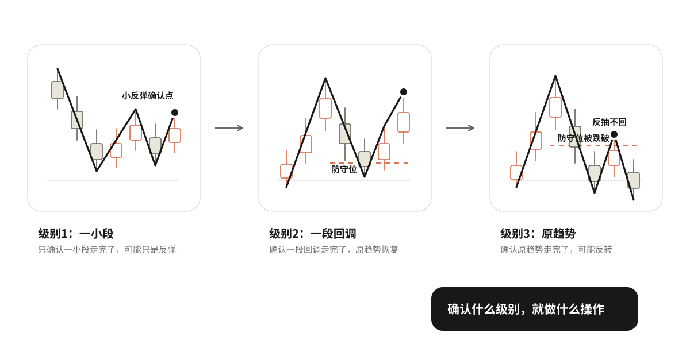

# 05 从观察到确认

上一章在一段画好的走势上，找到了趋势可能改变的位置。现在问题来了：价格到了这些位置，是不是就出现买卖机会了？

不是。到了这些位置，只是进入观察区，开始盯。能不能动手，还要等证据确认。

```text
到了关键位置 → 进入观察 → 等证据 → 确认点出现 → 确认是什么级别
```



## 观察不等于确认

这是本章最容易搞错的地方：

> 观察区是"开始盯"的地方，确认点是"可以动手"的地方。两者不是一回事。

到了防守位，只是说"这里可能止跌"，不是说"已经止跌了，可以买了"。到了压力位，只是说"这里可能滞涨"，不是说"已经滞涨了，可以卖了"。到了横盘的上沿或下沿，只是说"这里可能突破或跌破"，不是说"已经突破了，可以追了"。

为什么要分得这么清楚？因为到了关键位置之后，价格可能守住，也可能跌破；可能反弹，也可能直接跌下去。在证据出现之前就动手，等于在猜。

观察 = 知道要盯什么，但还不动手。确认 = 证据出现了，可以动手了。



## 等什么证据，确认点在哪里

证据不是看感觉，是看具体的点。价格到了关键位置之后，出现了什么变化，才算确认？

以买入为例。价格跌到防守位之后，不会直接V型反转上去，通常会先在底部来回晃几下。晃的过程中，会形成一个小高点——就是反弹到某个位置又跌回来的那个高点。确认买入的信号，就是价格突破这个小高点。

为什么是突破小高点？因为在这之前，价格一直在"反弹→被压回来→再反弹→再被压回来"的循环里。突破小高点，说明这个循环被打破了，往上的力气第一次压过了往下的力气。

卖出反过来。价格反弹到压力位之后，在顶部来回晃，形成一个小低点——就是回落到某个位置又拉上去的那个低点。确认卖出的信号，就是价格跌破这个小低点。

这个小高点或小低点不是随便找的，是价格在关键位置附近自然形成的。第二章讲过怎么选点，这里直接用。

### 两种路径

确认的过程，常见的有两种路径。

**路径一：有二次回试（更常见，更稳）**

还是以买入为例。价格跌到防守位之后，先止跌反弹了一下（第一次试探），然后又回踩下来，但没有跌破防守位（第二次检验），回踩不跌破再往上走，突破小高点，确认。

二次回试增加了什么信息？第一次反弹可能是假的，诱多；第二次回踩还守得住，说明不是假的，确认力度更强。

卖出反过来：到压力位先滞涨回落，然后反抽不突破压力位，再往下走，跌破小低点，确认。横盘突破也一样：突破上沿后回踩不跌破，确认突破；跌破下沿后反抽不突破，确认跌破。

**路径二：直接突破或跌破（没有二次回试）**

有时候价格不回来测试，直接拉上去或砸下去。比如跌到防守位之后，一根大阳线直接拉上去，根本不给回踩的机会。

这种情况已有证据是方向明确、力度强，缺少的是二次检验，不知道是不是假突破。怎么办：确认力度弱一些，一旦不对就走，不要恋战。

> 二次回试是常见路径，不是必要条件。不能说"没有回踩就不能买"。

有些行情就是直接拉上去的，等回踩反而踏空。但直接突破的确认力度弱，仓位要轻，止损要近。



## 确认之后，先问自己：这是什么级别的信号

确认信号出现了，先别急着动手。问自己一个问题：这个信号确认的是什么？是一小段走完了，还是一大段走完了？

这个问题不搞清楚，很容易犯一个常见错误：看到一个买入信号就以为是大底，重仓杀入，结果只是一个小反弹，涨两根就跌回去了。

确认信号分三个级别：

**1. 只确认了一小段走完了**

比如下跌趋势中，价格跌到某个位置，出现了一个买入确认信号。但这个信号只是说明刚才那一笔下跌走完了，后面可能有一笔反弹，反弹完了还会继续跌。这种级别的确认，只能做一小段，快进快出，赚一点就走，不要拿着不放。

**2. 确认了一段回调或反弹走完了**

比如上升趋势中，价格回调到防守位，出现了买入确认信号。这个信号说明这一段回调走完了，原来的上升趋势要恢复了。这种级别的确认，可以顺着原趋势做，持有时间可以长一些，目标是吃到下一段上升。

**3. 确认了原趋势走完了**

比如上升趋势中，防守位被有效跌破，反抽也不回来，然后出现了卖出确认信号。这个信号说明整个上升趋势的结构被破坏了，可能要进入更大级别的下跌。这种级别的确认，可以考虑反向操作。但这是最大级别的变化，需要的证据最多，不能轻易下结论。

三个级别，对应三种完全不同的操作。关键一句话：

> 你确认的是什么级别，就做什么级别的操作。不要把一个小信号当成大转折。



## 练习

拿一段已经到了关键位置的走势，写清楚四件事：

1. 现在在观察什么？
2. 还缺什么证据？确认点在哪里？
3. 如果证据出现，确认的是什么级别的信号？
4. 对应这个级别，你打算怎么做？
