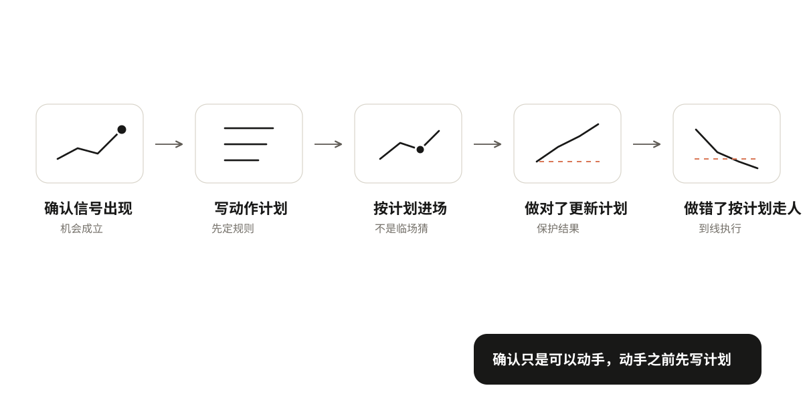
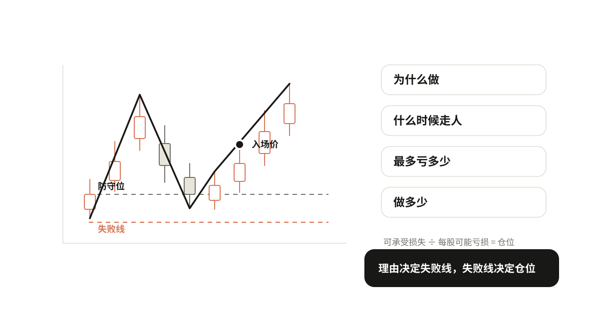
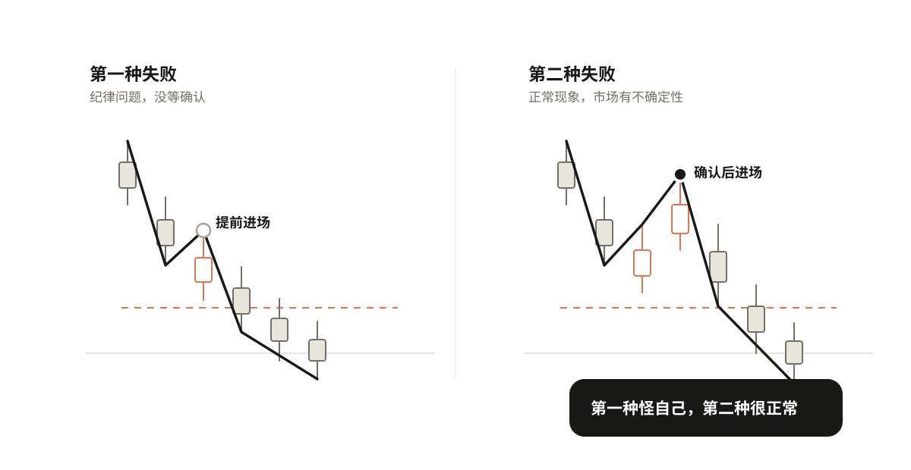
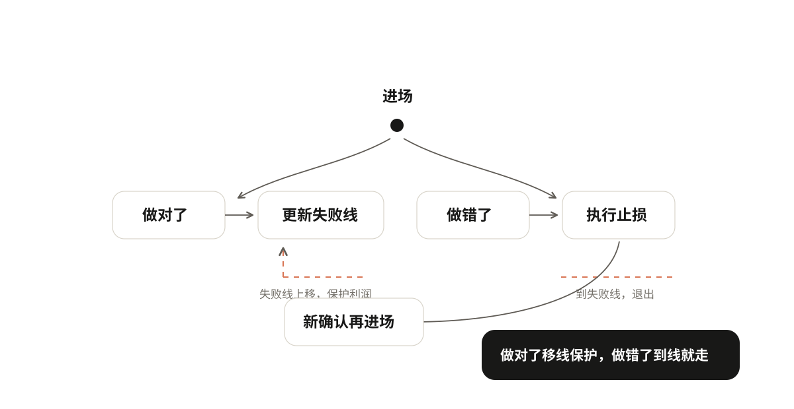

# 06 决定动作，承担失败

确认信号出现了，是不是就可以直接买/卖了？不是。确认只是告诉你"可以动手了"，但动手之前要先写计划。

```text
确认信号出现 → 写动作计划 → 按计划进场 → 做对了更新计划 / 做错了按计划走人
```



## 动手之前先写一份动作计划

进之前先想清楚四件事：为什么做、什么时候走人、最多愿意亏多少、做多少。这四件事写不清楚，就不要动手。

### 为什么做：写清理由

你为什么要做这笔交易？理由要具体，不能说"我觉得要涨了"。

理由要写清楚：当前什么结构、到了什么位置、出现了什么确认信号、确认的是什么级别。比如：

> 上升趋势中，价格回调到防守位C，底部形成小高点H后被突破，确认一段回调结束、上升恢复。

这就是一个完整的理由。有结构、有位置、有信号、有级别。

还要写清当前是否持仓：空仓开新仓、持仓加仓、持仓平仓，理由不同。空仓是"要不要进"，持仓是"要不要加"或"要不要出"，不能混。

理由写不清楚，说明你还没想明白，不要动手。

### 什么时候走人：从理由推导失败线

理由写清楚了，失败线自然就出来了。什么变化出现，说明你这次判断错了？这个位置就是失败线。

比如上面那个理由："回调到防守位，突破小高点，确认上升恢复"——那失败线就是"跌破防守位C"。因为跌破了C，就说明上升恢复不成立，判断错了。

理由和失败线是对应的：你因为什么理由进来，就因为什么理由出去。失败线不是随便设的，是从你的理由推导出来的。理由变了，失败线也要跟着变。

到了失败线就走人，不要犹豫，不要"再看看"。

### 三个概念不要混

这里有三个容易搞混的概念，分开说：

- **关键线**：第三章找到的防守位、压力位、横盘上下沿。这是"值得盯的位置"。
- **判断失败线**：说明你这次判断不成立的位置。这是从你的理由推导出来的，可能和关键线在同一个位置，也可能不在。
- **实际止损执行价**：真正下单止损的价格。可能比判断失败线再低一点（买入时）或高一点（卖出时），防止毛刺扫损。

举个例子：防守位C在10元，你的判断失败线也是10元，但实际止损执行价你设在9.8元——因为有时候价格会瞬间刺破10元又拉回来，设9.8元可以避免被毛刺扫掉。这三个位置可能重合，也可能不重合，不要混为一谈。

### 最多愿意亏多少：可承受损失

这笔交易你最多愿意亏多少钱？这是资金管理，不是判断。先想清楚你能接受亏多少，再决定做多少。不要上来就想"我要赚多少"，要先想"我最多能亏多少"。

### 做多少：仓位由失败线和可承受损失算出

仓位不是拍脑袋定的，是算出来的：

```
入场价到失败线的距离 = 每股/每手可能亏多少钱
你最多愿意亏的总金额 ÷ 每股可能亏损 = 你能做多少仓位
```

举个例子：入场价10元，失败线9.5元，每股可能亏0.5元。你这笔交易最多愿意亏5000元。那你能买的股数 = 5000 ÷ 0.5 = 10000股。如果到了失败线9.5元，你就走人，实际亏损刚好是5000元，在你能承受的范围内。

确认力度弱（比如直接突破、没有二次回试），仓位可以轻一些；确认力度强（有二次回试），仓位可以重一些。但这只是参考，核心还是由可承受损失决定。



## 两种失败，两种复盘

失败不可怕，但要分清楚是哪种失败。两种失败的原因完全不同，复盘方式也不同。

**第一种：提前把观察当确认。** 还没等确认信号出现，就提前动手了。比如价格刚到防守位，还没形成小高点、还没突破，你就急着买了，结果买了之后继续跌。这是纪律问题，不是方法问题。你没按规则等确认，提前进场了。复盘的时候要问自己：为什么没等确认？是着急了，还是觉得"这次不一样"？

**第二种：按规则确认后仍失败。** 你严格按规则等了确认，理由也写清楚了，失败线也设好了，但后来市场还是走到了失败线。这是正常现象，不是你的错。市场本来就有不确定性，没有任何方法能100%正确。你按规则做了，该做的都做了，但这次判断刚好错了，这很正常。复盘的时候检查：规则执行到位了吗？理由写清楚了吗？失败线设对了吗？如果都没问题，那这次失败就是正常的，下次还是按规则来。

> 第一种失败是"你没按规则做"，第二种失败是"你按规则做了但这次错了"。两者完全不同，不要混为一谈。

不要因为第二种失败就怀疑方法，也不要因为第一种失败就怪市场。



## 做对了怎么更新，做错了怎么执行

计划写好了，进场之后怎么办？

**做对了：更新计划。** 价格顺着你的方向走了，说明判断对了。这时候可以更新失败线，保护已经赚到的利润。比如你买入后价格涨了，形成了新的防守位，那就把失败线上移到新的防守位。这样即使后面跌回来，你也能保住一部分利润。

但失败线不能随便移。移动要有依据：新的防守位形成了，才能移；不能因为"想多赚一点"就把失败线移到更远的地方。

**做错了：执行。** 价格到了失败线，就执行止损，不要犹豫。不要"再看看"，不要"说不定还能回来"，不要把失败线往下移（买入时）来"给它多一点空间"。到线就走，这是纪律。

实际止损执行价可能比判断失败线再低一点，防止毛刺扫损——但这个差价要在计划里提前写好，不能临场决定。临场决定的止损，往往是"不想认怂"的借口。

**退出之后怎么办。** 止损了，不代表以后不能再做。如果退出之后出现了新的确认证据，再做新判断，重新进场。不要因为刚止损就"怕了"，也不要因为刚止损就"急着赚回来"。每一笔都是独立的判断，上一笔亏了不影响下一笔的判断。

还有一个容易搞错的点：卖出后价格继续上涨，这是机会成本，不是止损错误。不要因为卖了之后涨了，就说"我不该卖"。卖出是按计划执行的，执行没错；卖了之后涨了，是市场后续走的，和你的执行无关。



## 练习

拿一个确认信号，写一份完整的动作计划：

1. 理由：什么结构、什么位置、什么确认信号、什么级别？
2. 失败线：什么变化出现说明判断错了？
3. 可承受损失：这笔交易最多愿意亏多少钱？
4. 仓位：入场价到失败线的距离是多少？能做多少仓位？
5. 更新规则：做对了，什么情况下可以移失败线？移到哪里？
6. 执行规则：到了失败线，实际止损价设在哪里？
