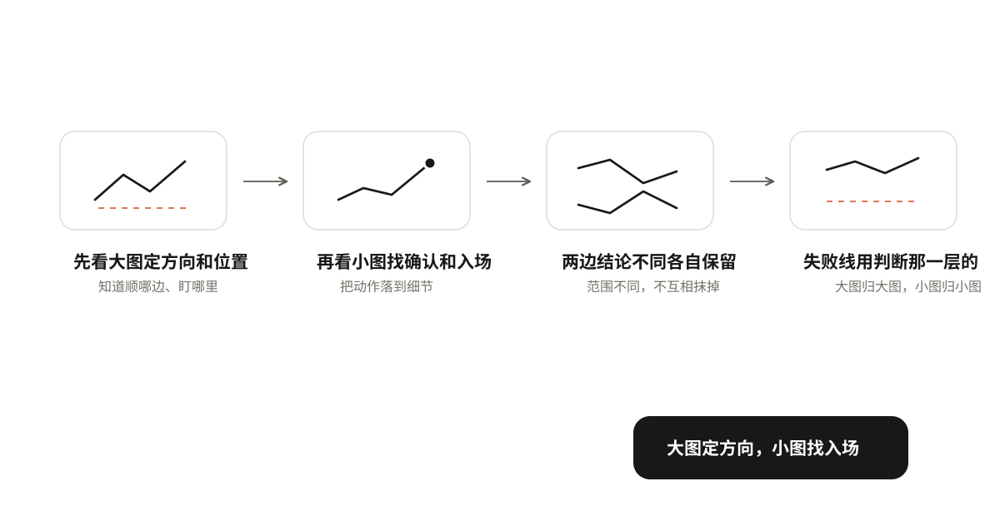
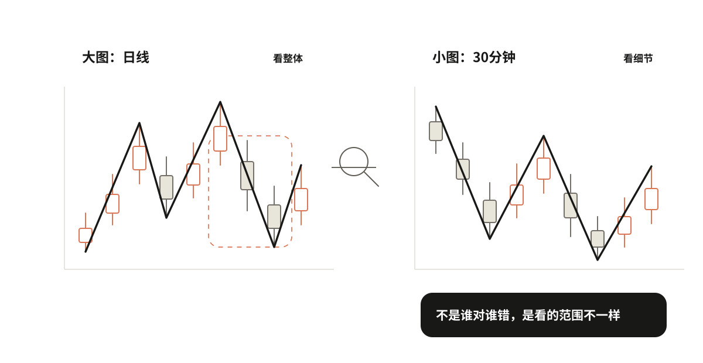
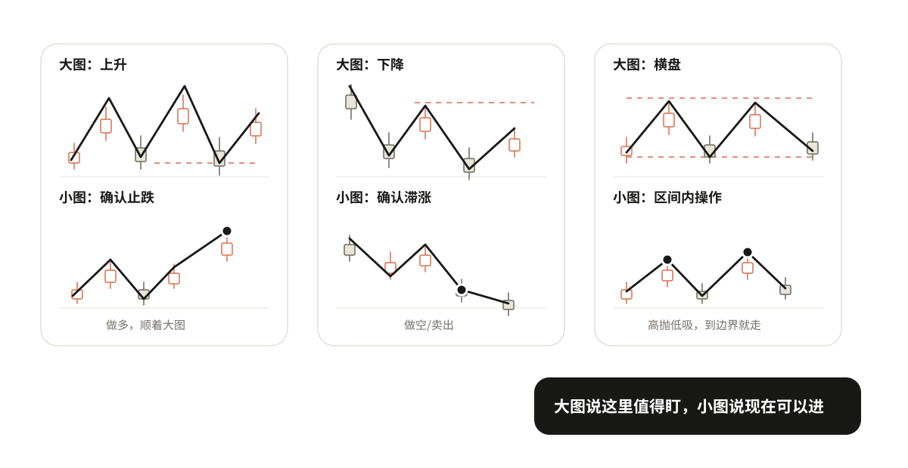
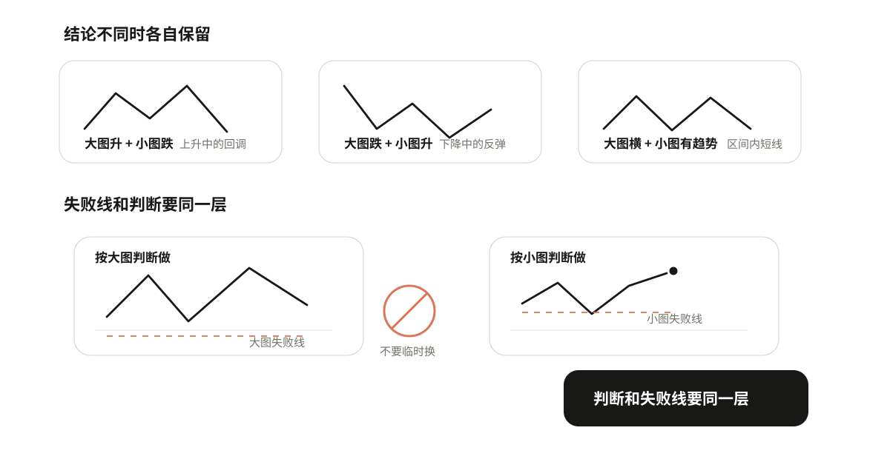

# 07 配合不同周期

前面几章都是在一张图上做判断。但实际看盘时，你会同时看大图和小图，有时候两张图结论不一样——日线看着要涨，切到30分钟又看着要跌。到底听谁的？

先给答案：大图定方向，小图找入场。

## 大图和小图是什么关系

同一段时间，放大看和缩小看，看到的东西不一样。

举个例子：日线图上的一根阴线，放到30分钟图里，可能是一段完整的下跌→反弹→再下跌。大图上的一次回调，小图里可能是好几次涨跌。

所以大图和小图不是矛盾关系，是范围不同：大图看的是整体，小图看的是细节。不是谁对谁错，是看的东西不一样。

这里提一句边界：日线、周线是数据周期，严格来说和缠论的结构级别不完全是一回事。但入门阶段先按"范围大小"来理解就够了，不用纠结术语。

## 大图看什么，小图看什么

大图告诉你"现在整体是什么趋势、关键位置在哪里"；小图告诉你"到了关键位置后，现在能不能进"。

下面分三种情况说。

### 情况一：大图是上升趋势

大图看到什么：整体上升，价格回调到了防守位。

小图看什么：在防守位附近，有没有止跌确认信号。比如小图形成小高点后被突破，说明止跌了。

怎么操作：小图确认了，就进场做多，顺着大图的上升趋势做。

举个具体例子：日线是上升趋势，价格回调到日线防守位C。这时候切到30分钟图，看到30分钟在C附近形成了小高点H，然后价格突破了H。这就是小图给的确认信号，可以进场。

### 情况二：大图是下降趋势

大图看到什么：整体下降，价格反弹到了压力位。

小图看什么：在压力位附近，有没有滞涨确认信号。比如小图形成小低点后被跌破，说明滞涨了。

怎么操作：小图确认了，就进场做空，或者卖出持仓。

反过来要注意：如果大图是下降趋势，小图出现了买入信号，那只是反弹，不是反转。可以做，但要快进快出，不要拿着不放。不要因为小图涨了，就说大图下降结束了。

### 情况三：大图是横盘

大图看到什么：价格在一个区间里来回走，没有清楚方向。

小图看什么：到了区间下沿，小图有没有止跌信号；到了区间上沿，小图有没有滞涨信号。

怎么操作：可以在区间内高抛低吸——下沿附近小图确认止跌就买，上沿附近小图确认滞涨就卖。但要注意：到边界就走，不要追，不要当成趋势来做。横盘里的操作是"区间内的短线"，不是"趋势持仓"。

所以大图横盘时小图可以找操作，但只能在区间内做，到边界就走，不能追。

> 先看大图定方向和位置，再看小图找确认和入场。大图说"这里值得盯"，小图说"现在可以进"。

## 你可以自己试试

  <iframe class="h-ch7" src="interactives/ch7-timeframe-zoom.html" title="大图小图演示器" loading="lazy" scrolling="auto" style="height:870px"></iframe>
  
拖动滑块把日线回调逐天放大到30分钟，看“大图定方向、小图找入场”在一段走势里怎么落地。

## 两个实操提醒

**提醒一：两边结论不同时，各自保留，不要混。**

大图升、小图跌 = 上升中的回调。等小图跌完出现确认再进，不要因为小图跌了就说大图上升结束了。

大图跌、小图升 = 下降中的反弹。快进快出，不要因为小图涨了就说大图下降结束了。

大图横、小图有趋势 = 区间内的短线。到边界就走，不要追。

原则：局部反弹不直接证明整体下降结束，局部下跌也不直接证明整体上升结束。各自保留各自的判断，不要混。

**提醒二：失败线用哪一层的，进场前写清楚，不要临时换。**

你按大图的判断做的，就用大图的失败线。你按小图的判断做的，就用小图的失败线。

最常见的错误：进场时用小图的失败线（近，亏得少），持仓后又换成大图的失败线（远，亏得多）。本来小亏的交易，变成了大亏。

进场之前就要写清楚：这次动作采用哪一层的失败条件。写好了就不要改。

举个例子：你看日线上升，回调到日线防守位，然后看30分钟出现确认信号进场。如果你是按"日线上升恢复"做的，失败线就用日线防守位；如果你是按"30分钟一笔反弹"做的，失败线就用30分钟的低点。进场前定好，不能临场换。

## 自己动手练一下

拿一段走势，同时看大图和小图，写清楚四件事：

1. 大图是什么趋势？关键位置在哪里？
2. 对应哪种情况（上升/下降/横盘）？
3. 小图在大图关键位置附近有没有确认信号？
4. 如果进场，你是按哪一层的判断做的？失败线用哪一层的？
