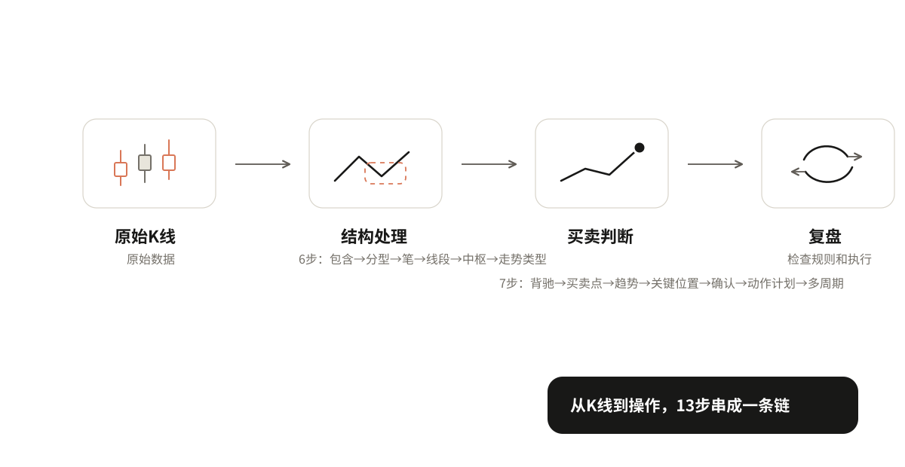
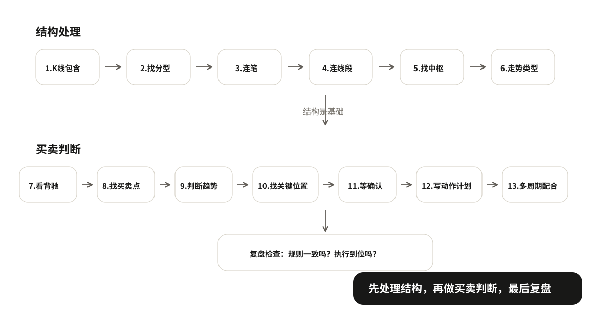

# 08 独立判断与复盘

前面学了很多概念，从 K 线包含到买卖点，从趋势判断到动作计划。但这些概念是分散学的，实际看盘时它们是怎么串起来用的？

拿一段上升趋势中回调的日线走势，从回调开始的位置，一步一步走到最终操作判断。每一步只说做什么、得到什么，不重新解释概念。重点是看清楚这些概念怎么一环扣一环串起来。

```text
原始K线 → 结构处理 → 买卖判断 → 复盘
```



## 完整演示

拿一段上升趋势中回调的日线走势来演示。从回调开始的位置，一步一步处理。

### 第一类：结构处理

这部分把基础结构的概念串起来，从原始K线到走势类型。

**第1步：K线包含处理**

做什么：把有包含关系的K线合并。上升趋势中取高高，下降趋势中取低低。

得到什么：处理后的K线序列，没有包含关系，可以找分型了。

**第2步：找分型**

做什么：在处理后的K线上找顶分型和底分型。三根K线，中间那根的最高点最高就是顶分型，最低点最低就是底分型。

得到什么：一系列顶分型和底分型，标记它们的位置。

**第3步：连笔**

做什么：相邻的顶分型和底分型之间连成笔。顶到底是向下笔，底到顶是向上笔，至少5根K线。

得到什么：一系列向上笔和向下笔，标记每一笔的起止点。

**第4步：连线段**

做什么：至少三笔组成线段。向上线段从低点开始，向下线段从高点开始。看线段的方向和起止点。

得到什么：一系列向上线段和向下线段，标记每一段的起止点。

**第5步：找中枢**

做什么：至少三段重叠形成中枢。看重叠的区间，上沿是三段中最低的高点，下沿是三段中最高的低点。

得到什么：中枢的位置和区间，标记中枢上沿和下沿。

**第6步：判断走势类型**

做什么：看有几个同级别中枢。一个中枢是盘整，两个同向不重叠的中枢是趋势。趋势看方向，上升还是下降。

得到什么：当前走势是盘整还是趋势。如果是趋势，是上升趋势还是下降趋势。

到这里，结构就处理完了。你得到了：处理后的K线、分型、笔、线段、中枢、走势类型。这些是后面买卖判断的基础。

### 第二类：买卖判断

这部分把判断和动作串起来，从力度变化走到最终操作计划。

**第7步：看力度和背驰**

做什么：比较同方向走势的力度。先看价格幅度、推进速度和回撤深度；需要指标辅助时，再看 MACD 面积和高度。

得到什么：走势有没有变弱，有没有背驰。它只说明需要警惕，不直接等于动作。

**第8步：判断当前趋势**

做什么：结合高低点关系和中枢位置，看当前更像上升、下降、横盘，还是证据不足。

得到什么：当前判断的背景是什么，后面是在顺势找机会，还是在观察可能转折。

**第9步：找关键位置**

做什么：上升趋势找最近保护上涨的有效低点（防守位），下降趋势找最近压住反弹的有效高点（压力位），横盘找区间上下沿。

得到什么：哪里值得重点观察，关键线是否需要扩成关键区。

**第10步：进入观察**

做什么：价格来到关键位置以后，先写清楚自己在观察什么。比如防守位附近观察能不能止跌，压力位附近观察能不能滞涨。

得到什么：这里还只是观察，不把到位置当成确认。

**第11步：等确认**

做什么：等待右侧结构证据。买入确认通常是小高点被突破，卖出确认通常是小低点被跌破；对应到缠论买卖点时，也要说清它确认的是什么级别。

得到什么：有没有确认，确认的是什么级别。

**第12步：写动作计划**

做什么：写清楚四件事——为什么做（理由）、什么时候走人（失败线，从理由推导）、最多愿意亏多少（可承受损失）、做多少（仓位，由损失和失败线算出）。

得到什么：一份完整的动作计划。

**第13步：多周期配合**

做什么：看大图定方向和关键位置，看小图找确认信号和入场点。确定失败线用哪一层的，进场前写清楚，不要临时换。

得到什么：最终的操作方案。

到这里，从原始K线到最终操作判断的完整流程就走完了。后面就是按计划执行，然后复盘。



## 复盘与总结

### 复盘检查三件事

走完一遍之后，复盘检查三件事：

1. **规则是否一致**：每一步有没有按规则做？包含处理对不对？分型找对了吗？笔连对了吗？中枢画对了吗？确认等了吗？失败线按理由推导了吗？
2. **执行是否符合计划**：进场按计划了吗？到失败线执行了吗？移动失败线按规则了吗？
3. **最后结果如何**：赚了还是亏了？注意：结果好不代表方法对，结果差不代表方法错，关键看规则和执行。

### 一页可重复使用的记录表

把整个流程整理成一张表，以后每次判断都可以用：

| 步骤 | 做什么 | 得到什么 |
|---|---|---|
| 1. K线包含处理 | 合并有包含关系的K线 | 处理后的K线序列 |
| 2. 找分型 | 找顶分型和底分型 | 分型位置 |
| 3. 连笔 | 相邻顶底分型连成笔 | 向上笔/向下笔 |
| 4. 连线段 | 至少三笔组成线段 | 向上线段/向下线段 |
| 5. 找中枢 | 至少三段重叠形成中枢 | 中枢区间 |
| 6. 判断走势类型 | 看有几个同级别中枢 | 盘整/趋势（上升/下降） |
| 7. 看力度和背驰 | 比较同方向走势的推进力度 | 有没有变弱或背驰 |
| 8. 判断当前趋势 | 结合高低点和结构位置 | 上升/下降/横盘/证据不足 |
| 9. 找关键位置 | 防守位/压力位/上下沿 | 哪里值得重点观察 |
| 10. 进入观察 | 价格是否来到关键位置 | 观察什么，不急着动手 |
| 11. 等确认 | 小高点突破/小低点跌破，或对应买卖点成立 | 有没有确认，什么级别 |
| 12. 写动作计划 | 理由/失败线/可承受损失/仓位 | 完整动作计划 |
| 13. 多周期配合 | 大图定方向，小图找入场 | 最终操作方案 |

复盘结论：规则一致吗？执行到位吗？结果如何？

### 全书总结

整个技术体系就是一条链：

> 从 K 线到结构，从结构到趋势，从趋势到位置，从位置到确认，从确认到计划，从计划到执行。

核心就几句话：先处理结构，再判断趋势，找到关键位置，等确认信号，写好动作计划，按计划执行，复盘检查。

多练习，按规则做，不要临场发挥。规则是你的朋友，情绪是你的敌人。
