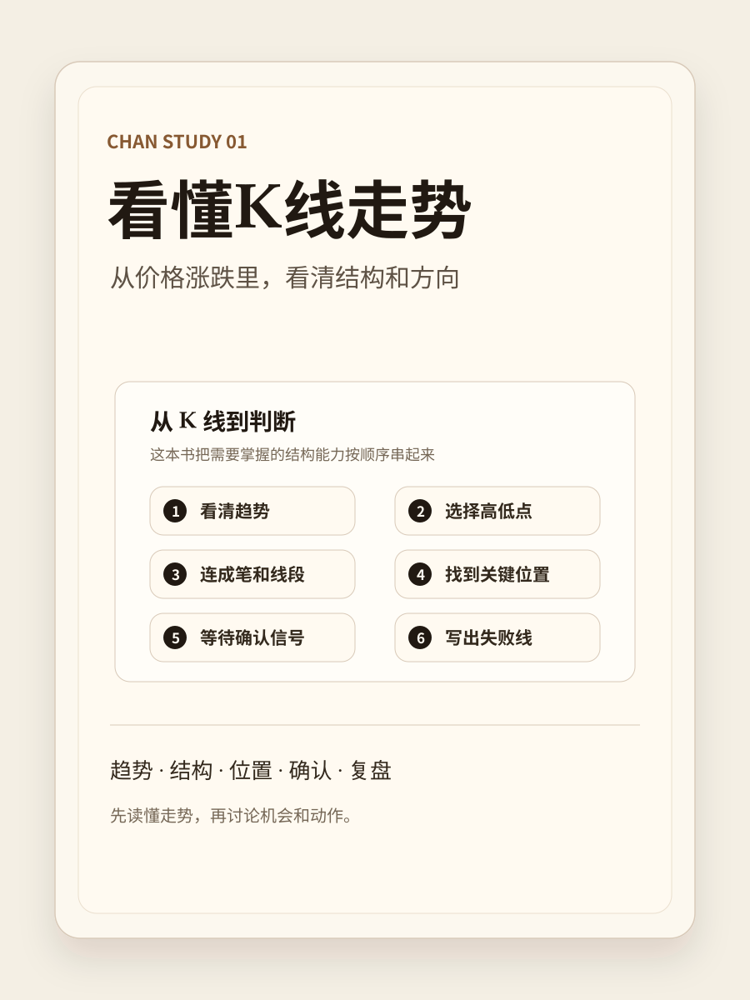

# 导读



> 这本书主要讲一件事：怎样看清楚当前趋势，以及趋势可能发生转折时，哪些只是信号，哪些才算确认。

很多人在看 K 线时，真正困惑的不是“不知道上涨和下跌是什么”，而是：

- 现在到底还是上升趋势，还是已经开始变弱？
- 这次回调只是正常回调，还是趋势要坏了？
- 跌破了一个低点，是不是就说明已经反转？
- 反弹回来了，是修复成功，还是只是下跌中的反弹？
- 我看到一个可能买点，到底是观察点，还是确认点？
- 如果判断错了，应该在哪里认错？

这本书就是围绕这些问题写的。

它不是一上来教你“买”或“卖”，也不是堆一堆缠论术语。它先训练一个更基础的能力：在真实 K 线图上，看清楚一段走势正在处于什么状态。

## 这本书要你学会什么

为了看清楚趋势和趋势转折，本书会依次讲清楚七件事。

第一，怎么判断当前趋势。

上升趋势不是一根大阳线，而是有效高点抬高、有效低点也抬高。下降趋势相反。震荡也不是“看不懂就叫震荡”，而是高低点在一个区间里反复重叠。

第二，怎么判断趋势有没有变弱。

上涨还在创新高，不代表完全安全。新高幅度变小、回调加深、反弹无力、反复靠近防守区，都可能说明趋势进入尾声。

第三，什么是保护趋势的关键线。

上升趋势里要看防守位和防守区；下降趋势或破防之后，要看压力位；震荡区间里，要看上沿和下沿。关键线不是为了预测，而是为了判断原来的结构还在不在。

第四，什么是观察区。

价格到了关键线附近，只能说明“这里值得观察”，不能说明“这里可以买”。观察区的意义是提醒你开始看右侧走势，而不是让你马上动手。

第五，什么是确认点。

确认点不是碰到防守位，也不是一根反弹阳线。更严谨的确认，通常要看到二次不破、收盘突破小高点、站上压力位、回踩守住、再次转强。

第六，什么是失败线。

任何买入、接回、加仓动作，都必须知道如果错了在哪里认。没有失败线，就不是一个完整动作，只是一个想法。

第七，判断清楚以后怎么做动作。

不同状态对应不同动作：观察、试错、正常仓位、持有、减仓、退出、接回。动作大小要跟确认质量和失败线距离匹配。

## 为什么按这个顺序学

因为真实走势不是突然从“上涨”变成“下跌”。它通常会经历一个过程：

```text
上升趋势
→ 趋势减弱
→ 跌破防守位
→ 破位观察
→ 震荡或修复
→ 转折确认或原趋势恢复
```

如果你没有这条线索，就会很容易在两个地方犯错：

- 看到回调就害怕，以为趋势已经结束；
- 看到反弹就兴奋，以为转折已经确认。

本书的核心目标，就是帮你把这中间的状态拆开：哪些只是信号，哪些进入观察，哪些才算确认，哪些已经失败。

## 本书的基本看盘顺序

```text
先判断趋势
→ 再看趋势是否变弱
→ 找防守位 / 压力位 / 震荡边界
→ 到关键区域后只当观察
→ 等右侧确认点
→ 同时设失败线
→ 再决定动作大小
```

严格缠论里的分型、笔、线段、中枢、背驰，会在第一册和第三册里继续严谨化。本书先用学习版语言，把“看清楚趋势和转折”这件事讲明白。

## 阅读顺序

建议阅读顺序：

1. [序言：从看清趋势到处理转折](preface.md)
2. [第 1 章 趋势、关键线与防守区](01-趋势与关键线.md)
3. [第 2 章 观察区到确认点](02-观察区到确认点.md)
4. [第 3 章 买入错误如何承担](03-错误承担.md)
5. [第 4 章 真实历史K复盘](04-真实历史K复盘.md)
6. [第 5 章 仓位动作：不同状态做不同大小的动作](05-仓位动作.md)
7. [第 6 章 多级别联动：方向和入场不要混用](06-多级别联动.md)
8. [第 7 章 个人复盘模板](07-个人复盘模板.md)
9. [附录 A 练习器入口](appendix-a-exercises.md)
10. [附录 B 精选配图索引](appendix-b-diagrams.md)

## 复习口诀

> 上涨看防守，尾声看风险，破位先观察，震荡看边界，下降先规避。  
> 观察不是买点，确认必须有失败线。
