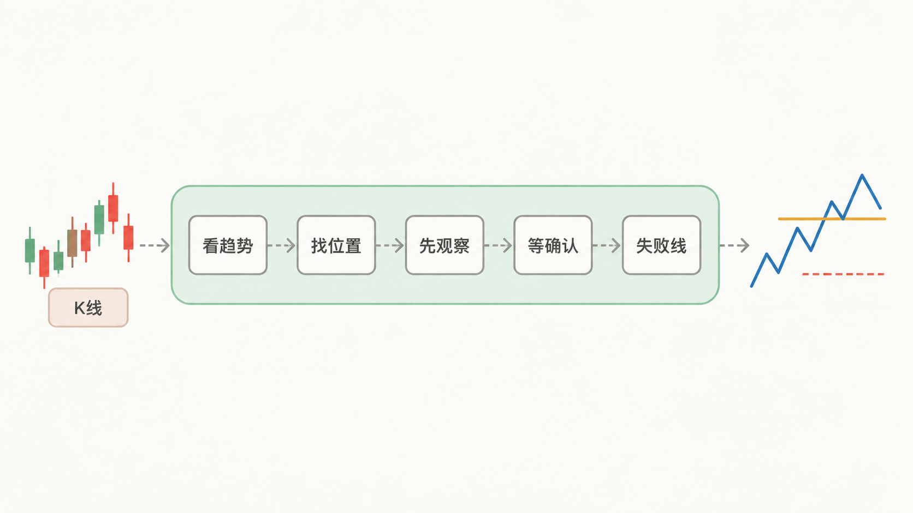

# 导读

> 不是给你一个买卖点，是让你心里有数。

打开一张K线图，你最想知道什么？

大概率不是"这里能不能买"——而是：现在到底是在涨还是在跌？这次回调是正常的，还是趋势已经坏了？价格到了一个关键位置，是不是就可以动手了？如果买错了，在哪里认？

这些问题，才是真正难的。买点只是最后那一下，前面的判断搞不清楚，买点就是个感觉。

这本书就是围绕这些问题写的。它不把你直接推到"买点""卖点"，而是带你走一条更稳的判断链：先看清趋势，再画出走势，再判断结构强弱，找到关键位置以后等确认，最后才决定动作。

## 这本书怎么写

不是按"分型→笔→线段→中枢→背驰→买卖点"的顺序硬塞术语。

而是你遇到什么问题，就讲什么概念——你要判断趋势，就需要高点低点；你要找关键位置，就需要防守位压力位；你要确认转折，就需要观察区确认点。

概念是工具，不是目的。你需要它来解决问题了，才把它带出来。

## 八章讲了什么

第一章先帮你看清大方向——怎么判断现在是在涨、在跌，还是横着走。

第二章讲怎么自己从K线里把高点低点找出来，再连成一段一段的走势。

第三章继续看结构——这段走势是在继续往前推，还是只是在一个范围里来回晃？力气有没有变小？

第四章找关键位置——上升看防守位，下降看压力位，横盘看上下沿。哪里值得重点盯？

第五章区分观察和确认——到了位置只是开始盯，等右侧证据出现了，才叫确认。

第六章讲怎么动手——为什么做、什么时候走人、最多亏多少、做多少。确认也会错，所以得先知道失败线在哪。

第七章讲怎么配合不同周期——大图看整体，小图找入场，但不能混着改规则。

第八章把整条链走一遍，然后怎么复盘。

## 这本书不能帮你做什么

它不能预测未来。只能告诉你现在的结构是什么样的，后面怎么走谁也不知道。

它不能替你做决定。给的是判断和参考，但买不买、卖不卖，最后还是你自己定。

它也不能保证100%对。市场有不确定性，它只是把判断的依据摆出来，让你心里有个谱。

## 阅读顺序

建议阅读顺序：

1. [序言：从一个问题开始](preface.md)
2. [第 1 章 看清趋势](01-看清趋势.md)
3. [第 2 章 从 K 线画出走势](02-从K线画出走势.md)
4. [第 3 章 判断结构](03-判断结构.md)
5. [第 4 章 找到趋势可能改变的位置](04-找到趋势可能改变的位置.md)
6. [第 5 章 从观察到确认](05-从观察到确认.md)
7. [第 6 章 决定动作，承担失败](06-决定动作承担失败.md)
8. [第 7 章 配合不同周期](07-配合不同周期.md)
9. [第 8 章 独立判断与复盘](08-独立判断与复盘.md)
10. [附录 A 精选配图索引](appendix-a-diagrams.md)
