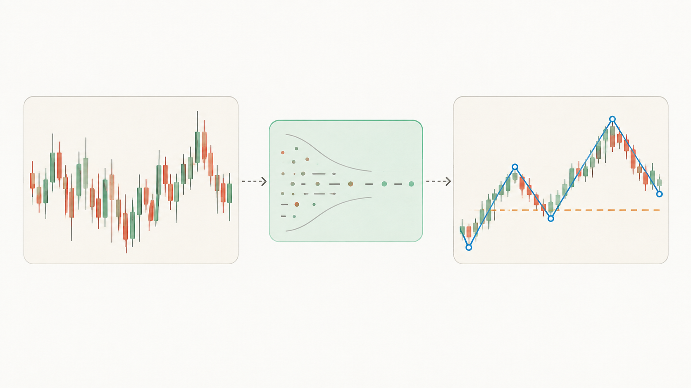

# 为什么需要这个工具？

## 想要的到底是什么？

直白点说，就是想知道——现在能不能买？能不能卖？

但真要是只给这俩字，反而更慌。

"能买？凭啥？买了涨了拿不拿？跌了呢？怎么知道是正常回调还是看错了？"

所以真正想要的，不是一个答案，是**心里有数**：

- 现在是在涨还是在跌？
- 如果在涨，涨多久了？到哪了？
- 涨得还有劲，还是没劲了？
- 接下来该盯着啥？

要的不是一个"买"字，是**自己能看明白这图是咋回事**。

## K线图的问题在哪？

就是太乱。

每天一根线，红的绿的上上下下，看着挺热闹。真问一句"现在是涨还是跌"，一下就懵了。

哪段算涨？从哪开始算跌？

价格不是直线涨上去的，肯定是涨一阵、歇一阵、再涨一阵；跌也一样，跌一阵、弹一阵、再跌一阵。

但盯着K线看，这些"段"根本看不出来。

## 这个工具是干啥的？

就是帮着把这堆乱糟糟的线，看成一段一段清楚的走势。

不是标"这是高点""那是低点"——那都是过程。
是直接看出来：

- 这里在涨，那里在跌
- 这段涨到头了没
- 这段跌得还猛不猛
- 现在是在趋势里，还是在拐弯的地方

**说白了：把K线图变成能看懂的走势图。**

看明白了，自己就知道该不该动了。

## 但它不能做什么？

先把话说在前面，免得期望错了。

**它不能预测未来。**
它只能告诉你：现在的结构是什么样的，现在走到什么位置了。后面怎么走，谁也不知道。

**它不能替你做决定。**
它给的是判断和参考——"现在是上涨趋势""建议观望"。但买不买、卖不卖、买多少，最后还是你自己定。

**它不能保证100%对。**
市场有不确定性，再严谨的规则也有判断错的时候。它只是把判断的依据摆出来，让你心里有个谱，不是给你一个稳赚的答案。

**它不能代替基本面。**
这个工具只看技术面——价格走势、结构、力度。公司好不好、行业怎么样、消息面有什么变化，这些它都不管。

说白了：**它帮你看明白图，但图只是市场的一部分。** 别把所有希望都押在它身上。

