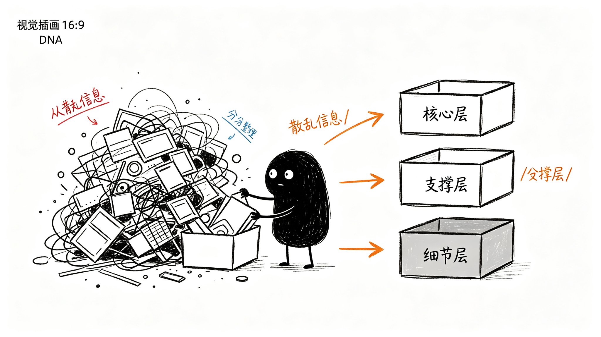

# 这些信息分几层？

第二章列了那么多东西——分型、笔、中枢、防守位、观察区、确认点、失败线，还有趋势判断、操作建议……要是一下子全画到图上，图就花了。

线啊、点啊、框啊、文字标签啊，密密麻麻挤在一起，反而什么都看不清。

所以得有个主次。最核心的东西，打开图一眼就要看到；次要一点的，需要的时候能找到；最细的细节，想看再点开。

## 信息分哪几类

这些信息其实可以分成三类：

第一类是**基础信息**——标的名称、代码、当前价格、K线本身、日期轴。这些是打开图就有的，不用特意说。

第二类是**技术标记**——画在图上的线和点，比如趋势线、防守位、观察区、确认点这些。

第三类是**结论判断**——工具帮你总结的人话，比如"现在是上涨趋势""建议观望""错了在这条线认"。

基础信息全部都要显示，不分层。下面主要讲技术标记和结论判断怎么分层。

## 技术标记分三层

### 第一层：核心标记——打开图就要看到的

**趋势线**和**防守位/压力位**。

为什么这俩是核心？

因为打开图，你第一个想知道的就是：现在是涨还是跌？现在关键位置在哪？

趋势线一眼就看出方向。防守位/压力位一眼就看出关键位置在哪。这俩东西是看图的基础，必须放在最显眼的地方。

### 第二层：支撑标记——需要判断的时候找

**观察区**、**确认点**、**失败线**。

为什么这些不是第一层？

因为大部分时候，价格就在趋势里走，你不需要盯着观察区、确认点这些东西。只有价格走到关键位置附近了，你才需要停下来仔细看：是不是进入观察区了？有没有确认？失败线在哪？

这些是辅助你做判断的，不是一眼扫过去就要看到的。

### 第三层：细节标记——想看再点开的

**分型**、**笔**、**中枢**、**买卖点具体位置**。

这些是底层结构。

为什么放第三层？

因为平时看盘，你不需要盯着每一个分型、每一笔在哪里。这些是支撑第二层判断的"证据"——为什么说这里是防守位？因为前面的笔和中枢决定的。为什么说这里是确认点？因为分型和笔的结构走到这了。

这些细节，你想研究的时候再展开看就行。

## 结论判断分三层

### 第一层：核心结论——第一眼就要看到的

**当前是什么趋势？** 和 **建议怎么操作？**

为什么这俩是核心？

因为你打开图，最想知道的就是：现在到底啥情况？我该不该动？

工具直接告诉你：现在是上涨趋势，建议观望。这两个信息是最直接的答案，必须放在最显眼的地方。

### 第二层：支撑结论——需要细看的时候看

**现在走到什么位置了？**、**力度怎么样？**、**错了在哪认？**

为什么这些不是第一层？

因为知道了"是上涨趋势""建议观望"之后，你可能会想多了解一点：走到哪了？力度还够不够？万一错了在哪认？

这些是支撑你做决策的补充信息，不是第一眼就要看到的。

### 第三层：细节结论——想追问的时候再展开

**为什么这么判断？**

为什么放第三层？

因为大部分时候，工具给的结论你直接用就行。但有时候你可能会想：凭什么说这是上涨趋势？凭什么说力度减弱了？

这时候你再点开来看具体的证据和依据就行。

## 三层是什么关系

总结一下：

- **核心层**：一眼扫过去就明白——现在啥情况？该不该动？
- **支撑层**：停下来细看，能找到支撑判断的依据——走到哪了？力度怎么样？错了在哪认？
- **细节层**：想深究了，再点开来看看——为什么这么说？依据是什么？

不是所有东西都要挤在一屏里。核心的先看到，其他的按需展开。

这样图才不会乱，你也能快速抓住重点。
