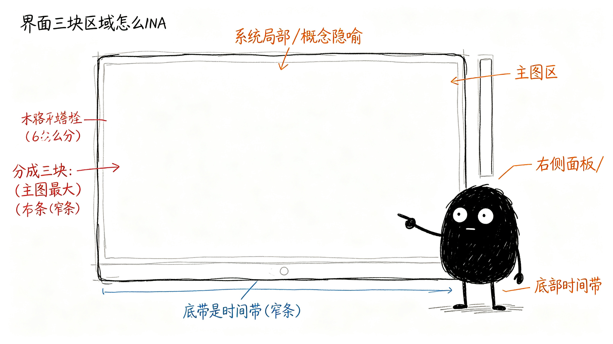

# 这些信息怎么摆？

第三章讲了信息分三层：核心层、支撑层、细节层。那这些东西在界面上怎么摆？主图放什么？右边放什么？底部放什么？

## 整体布局怎么分？

打开这个工具，界面大概分成三块：

**主图区——占大部分面积**
中间最大的那块，放K线和所有画在图上的标记。这是视觉核心，你的眼睛主要盯着这里。

**右侧面板——窄条**
主图右边一条窄条，放工具帮你总结的结论——现在是啥趋势？建议怎么操作？错了在哪认？

**底部时间带——窄条**
主图下面一条窄带，从左到右标着一段一段的趋势，扫一眼就知道整体走势是涨是跌。

## 主图区里，信息怎么排优先级？

主图上不能所有标记都一样明显，得有轻重：

**最粗最显眼的——趋势线**
连接高低点的那条线，一眼就看出现在是涨是跌。这是主图上最核心的视觉元素。

**次一级的——中枢**
震荡区域的边界，用细一点的线画出来。知道哪里是震荡核心，但不会抢趋势线的风头。

**只在最近的关键位置画——防守位/压力位、观察区、确认点、失败线**
历史上的防守位压力位，早就过去了，画在图上也是干扰。只有最近的、跟当前操作相关的关键位置，才值得标出来。这才是有效信息。

**细节默认隐藏——分型、笔**
这些是底层结构，平时不用全画出来。想看的时候点一下某个位置，再展开看细节。

## 右侧面板里，信息怎么排优先级？

右侧面板从上到下，也是先核心后次要：

**最上面——核心结论**
当前是什么趋势？建议怎么操作？这是你最想知道的，放在最上面一眼看到。

**中间——支撑结论**
现在走到什么位置了？力度怎么样？错了在哪认？这些是补充信息，放在核心结论下面。

**最下面——细节**
为什么这么判断？具体证据是什么？放在最下面，想追问的时候再看。

## 底部时间带呢？

底部时间带很简单，就是一段一段的趋势标记，从左到右排过去。不用分太多层，就是让你扫一眼就知道：前面这段是上涨，后面这段是下跌，现在到哪了。

这样摆下来，图不会乱，你打开就能一眼抓住重点。
