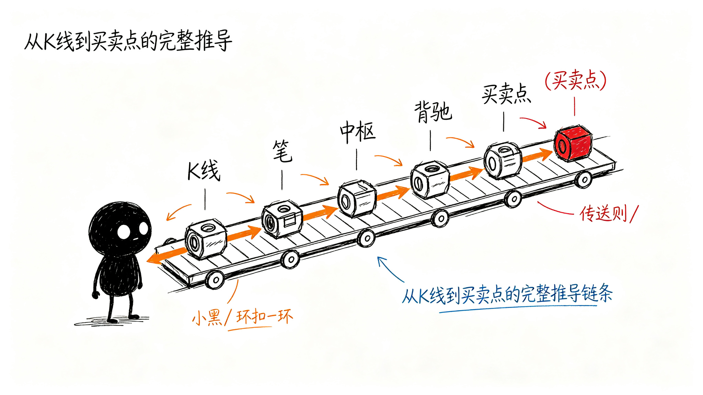

# 这些东西怎么保证可信？

前面讲了要画哪些信息、怎么分层、怎么摆。但你有没有想过——

说这里是防守位，凭什么？说这里是确认点，凭什么？说这里是一买，凭什么？

总不能是工具随便画一条线、点一个点，你就信了吧？

这一章就讲：每个标记背后都有明确的规则。从最基础的K线处理开始，一步一步往上推，每一步都有明确的判断标准。不是拍脑袋定的，所以才可信。

## 从K线到买卖点，一步一步来

整个过程就像搭积木——先有最基础的零件，然后一层一层往上搭。

| 步骤 | 做什么 | 解决什么问题 |
|---|---|---|
| 第一步：包含处理 | 把相邻的K线合并 | 先把乱糟糟的K线整理干净 |
| 第二步：分型 | 找顶分型、底分型 | 哪里是高点？哪里是低点？ |
| 第三步：笔 | 把高低点连起来 | 一段一段的波段出来了 |
| 第四步：线段 | 把笔组合成更大的结构 | 更大级别的走势出来了 |
| 第五步：中枢 | 找三个重叠的区间 | 震荡核心在哪？ |
| 第六步：走势类型 | 判断上涨/下跌/盘整 | 现在到底是涨是跌？ |
| 第七步：背驰 | 比较两段的力度 | 涨得还有劲，还是没劲了？ |
| 第八步：买卖点 | 确认一买、二买、三买 | 到底能不能买？ |

下面我们一步一步看。

## 先把K线整理干净

原始K线是一根一根的，有时候两根K线一上一下叠在一起，高低点互相包含，根本看不出什么。

所以第一步要做"包含处理"：相邻的K线如果有包含关系，就按方向合并成一根——上升方向取最高的高点、最低的低点；下降方向反过来。

整理完之后，K线就变成了一串干净的、没有包含关系的走势单元。

## 找高低点——分型

整理完K线，接下来找哪里是高点、哪里是低点。

怎么找？看连续三根处理后的K线：

- 中间那根的高点，比左右两根的高点都高 → 这就是**顶分型**（高点）
- 中间那根的低点，比左右两根的低点都低 → 这就是**底分型**（低点）

就这么简单。不是什么神秘的东西，就是看中间这根是不是比两边都突出。

## 把高低点连起来——笔

找到了高点和低点，接下来把它们连起来。

怎么连？**顶底交替连**——顶分型连到底分型，底分型再连到下一个顶分型，一上一下交替着来。

还有两个条件：
- 两个分型之间不能共用K线
- 中间至少要有一根独立的K线隔开

这样连出来的，就是一段一段的**笔**。一笔就是一个波段——从低点涨到高点，或者从高点跌到低点。

## 把笔组合成更大的结构——线段

有了笔，还需要更大的结构。三笔以上，起始三笔有重叠，首尾笔方向一致，就构成一个**线段**。

线段是比笔更大一级的走势单元。笔是小波段，线段就是大波段。

## 找震荡核心——中枢

有了笔和线段，接下来找震荡的核心区域。

怎么找？三个连续的、同级别走势对象（笔或者线段），它们有一段重叠的区间——这个重叠区间就是**中枢**。

简单说：来回震荡的中间那一块，就是中枢。

中枢有两个边界：
- **ZG**：上边界（重叠区间的最低点）
- **ZD**：下边界（重叠区间的最高点）

价格在中枢里面晃，就是震荡；突破中枢上沿，就是走强；跌破中枢下沿，就是走弱。

## 判断现在是涨是跌——走势类型

有了中枢，就能判断现在是什么走势类型了：

- **盘整**：只有一个中枢，上下晃
- **上涨趋势**：两个或以上中枢，依次往上走，后面的中枢比前面的高
- **下跌趋势**：两个或以上中枢，依次往下走，后面的中枢比前面的低

就这么简单。不是看K线涨了多少跌了多少，而是看中枢的位置关系。

## 怎么知道涨不动了——背驰

知道了是上涨趋势，接下来要问：涨得还有劲吗？还是涨不动了？

怎么判断？比较两段同向走势的力度。

比如上涨趋势里，前面那一段上涨和后面那一段上涨，哪段力度大？如果后面这段涨得更弱——涨的幅度更小、MACD面积更小——那就是**背驰**。

背驰意味着：虽然还在涨，但上涨的劲头已经不够了，可能快要拐头了。

## 买卖点怎么来的

有了前面所有的结构，最后才到买卖点。

| 买卖点 | 怎么来的 |
|---|---|
| **一买** | 下跌趋势里，背驰确认结束的位置——跌不动了，第一个买点 |
| **二买** | 一买之后，第一次回调结束的位置——回调不创新低，第二个买点 |
| **三买** | 突破中枢上沿之后，第一次回踩不破上沿的位置——回踩确认，第三个买点 |

卖点反过来就行。

## 总结

从最基础的K线处理，到最后得出买卖点，整个过程是一环扣一环的：

K线 → 分型 → 笔 → 线段 → 中枢 → 走势类型 → 背驰 → 买卖点

每一步都有明确的规则，不是随便画的。所以工具画出来的标记，你可以去查——为什么说这里是分型？因为中间三根K线就是这样的。为什么说这里是中枢？因为三笔就是在这个区间重叠的。

**每一个标记都有依据，每一步都可以追溯**——这就是为什么这个工具画出来的东西可信。
