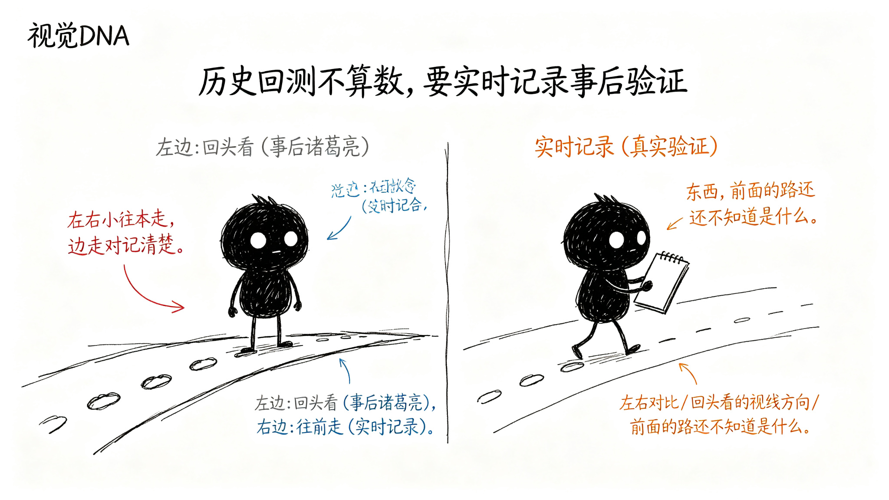

# 怎么知道它准不准？

前面五章讲了那么多规则——从分型到笔到中枢到买卖点，一步一步推导，看起来很严谨。

但你有没有想过一个问题：这些规则都是用历史数据验证出来的。你拿着过去的K线图，回头看，当然每一步都标得对——因为你已经知道答案了。

这能证明工具准吗？

不能。

## 为什么历史回测不算数？

因为用历史数据回头看，本质上是"事后诸葛亮"。

你知道后面涨了，所以回头看，这里是一买；你知道后面跌了，所以回头看，这里是一卖。怎么看都对。

但实际用的时候，你站在当时那个位置，你不知道后面会怎么走。你看到的只有当前和过去的K线。这时候工具给出的判断，后来证明对不对？这才是真问题。

所有用历史数据做的回测，都有这个问题——**过拟合**。规则是看着答案调出来的，当然全对。

## 正确的验证方式是什么？

不能回头看，只能往前走。

具体怎么做？很简单：

**每天收盘后，把工具当时给出的关键判断全部记录下来。**

记录什么？
- 当天工具判断当前是什么趋势？
- 当天工具判断现在走到什么位置了？
- 当天工具给出的操作建议是什么？
- 当天标记的关键位置：防守位、观察区、确认点、失败线分别在哪？

注意，记录的是**当时那个时间点，工具基于当时已有的数据给出的判断**。不是后来修正过的，也不是用了未来数据的。

## 过一段时间，回头来看

记录了之后，不是马上看对错。要等。

等一段时间——比如一两周、两三周，让后续走势走出来。然后回头看：

- 当时说"上涨趋势"，后来真的继续涨了吗？
- 当时说"进入观察区"，后来真的转折了吗？
- 当时说"确认点"，后来真的涨上去了吗？
- 当时说"失败线在这"，后来真的在这止损了吗？

一个一个对。对了算对，错了算错。

这样统计出来的准确率，才是真实的准确率。

## 错的case才是最有价值的

对的case看多了，你就知道工具大概什么水平。但真正能让工具变好的，是错的case。

每错一次，都要问：
- 当时工具为什么这么判断？
- 实际走势为什么不是这样？
- 是规则哪里没覆盖到？
- 还是当时的情况本来就模糊，人也判断不对？

把这些错的case拿出来分析，要么调整规则，要么在工具里标注"这种情况不确定"。

这样一轮一轮下来，工具就会越来越准——不是靠调参数凑历史数据，而是靠真实使用中暴露出来的问题来改进。

## 总结

历史回测看着再完美，都不算数。

真正的验证方式是：**站在当时的位置，不知道未来，看工具给出的判断，后来证明对不对。**

每天记录，定期复盘，用错的case来优化。这样迭代出来的工具，才是真的有用。

这也是为什么这个工具要做成"实时标记、可追溯"的——不是画完就完了，每一步都有记录，每一个判断都可以事后验证。
