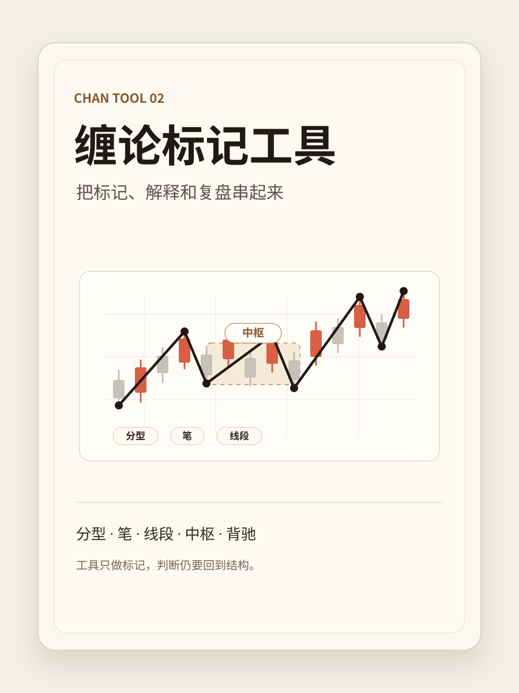

# 导读

> 本书沉淀缠论自动标记工具的规则、算法、界面和验证计划。它的目标不是神奇预测，而是让每一个标记都能解释、回放、追溯。

建议阅读顺序：

1. [序言：自动标记不是自动赚钱](preface.md)
2. [第 1 章 工具定位与状态口径](01-工具定位与状态口径.md)
3. [第 2 章 规则与算法边界](02-规则与算法边界.md)
4. [附录 A 规则与工具入口](appendix-a-source-map.md)
5. [附录 B 验收清单](appendix-b-checklists.md)
